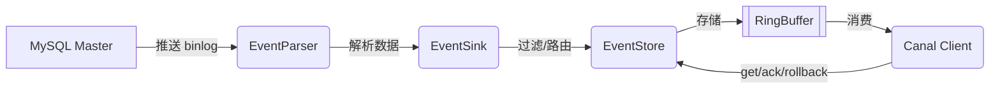

Canal 是阿里开源的基于 MySQL binlog 的增量数据订阅与消费组件，其架构设计核心在于**伪装 MySQL Slave 协议、增量数据解析、高可用部署**。以下从整体架构、核心组件、高可用机制三个维度详解其设计：

---

### 一、整体架构分层
Canal 架构分为两层，逻辑清晰：
1. **Server 层**
    - 对应一个 JVM 进程，管理多个 `instance`。
    - 负责资源调度、监控和 HA 协调（依赖 ZooKeeper）。
2. **Instance 层**
    - 每个 `instance` 独立处理一个数据源（如一个 MySQL 库）。
    - 核心模块：`EventParser`、`EventSink`、`EventStore`、`MetaManager`。

---

### 二、核心组件深度解析
每个 `instance` 由四个组件协同工作：

1. **EventParser：数据采集与解析**
    - **工作原理**：
        1. 从 `MetaManager` 获取上次解析位点（如首次启动则读取当前 binlog 位置）。
        2. 伪装 MySQL Slave 向 Master 发送 `BINLOG_DUMP` 命令。
        3. 接收 binlog 流，解析为二进制事件对象。
    - **关键点**：
        - MySQL 需开启 `binlog` 且格式为 `ROW` 模式。

2. **EventSink：数据加工与路由**
    - **核心功能**：
        - **过滤**：通过正则匹配表名（如 `canal\.user`）。
        - **路由**：支持 1→N（分发给多个 Store）或 N→1（多库合并到单 Store）。
        - **加工**：数据 Join 或转换。

3. **EventStore：数据存储模型**
    - **环形队列设计**：
        - 内存中使用 **RingBuffer** 存储数据，通过三个指针定位：
            - `Put`：写入位置（Sink 输入点）。
            - `Get`：读取位置（Client 消费点）。
            - `Ack`：确认位置（Client 处理完成点）。
        - 满足条件：`Put ≥ Get ≥ Ack`。
    - **持久化**：支持内存、本地文件或 ZooKeeper 存储。

4. **MetaManager：元数据管理**
    - 记录 binlog 消费位点、Client 状态。
    - 支持 ZooKeeper 或本地文件存储元数据。

---

### 三、高可用（HA）机制
通过 ZooKeeper 实现 Server 和 Client 双端 HA：

1. **Server HA 流程**
    - 多个 Canal Server 竞争创建 ZooKeeper 临时节点（EPHEMERAL）。
    - 成功创建节点的 Server 启动 `instance`，其他转为 Standby 状态。
    - 若活跃节点失效，ZooKeeper 通知其他 Server 重新竞争。

2. **Client HA 流程**
    - 单 `instance` 同一时间仅允许一个 Client 消费（保证有序性）。
    - Client 通过抢占临时节点锁定消费权，故障时自动切换。

> ✅ **优势**：避免多 Server 重复拉取 binlog，减少 Master 压力；Client 故障转移无感知。

---

### 四、典型应用场景
| **场景**          | **说明**                                                                 | **案例**                     |
|-------------------|-------------------------------------------------------------------------|----------------------------|
| **缓存更新**       | 数据库变更 → 刷新 Redis/ES                                              | 商品价格更新同步至缓存。 |
| **数据异构**       | 分库分表后，按查询维度重组数据                                           | 订单与用户表聚合查询。  |
| **任务下发**       | 数据变更 → 写入 Kafka → 触发下游任务                                     | 商品变更通知搜索服务。  |

---

### 附：架构图关键流程

通过此设计，Canal 实现**低延迟增量同步**与**高可靠数据消费**，支撑大规模数据异构场景。