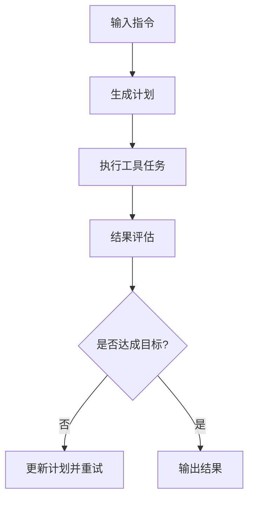

# 概览 — 什么是“大模型”（详解）

## 1. 定义与本质

“大模型”（Large Model / Foundation Model）通常指规模在数十亿参数到数千亿甚至万亿参数量级的深度学习模型。其本质包含两个维度：

* **规模效应（scale）**：参数量与训练数据规模显著大于传统模型，凭借更大的表达能力实现更强的泛化。
* **通用性（foundation）**：通过大规模自监督预训练学习到通用表示，可在多种下游任务上通过少量微调或提示（prompting）直接应用，因此被视为“基础模型”。

## 2. 特征与能力

* **自监督学习为主**：大量无标注数据（文本、代码、图像、音频等）上进行语言建模或跨模态预测，学习通用模式。
* **零/少样本能力（zero-/few-shot）**：在很多任务上不需要大量标注就能表现良好，尤其在参数与训练数据足够大时。
* **多模态潜力**：同一模型或模型族可以处理文本、图像、语音等不同模态的数据，支持跨模态任务（如视觉问答、图文生成）。
* **可迁移性强**：一个预训练模型可以通过微调、PEFT（参数高效微调）等方法适配到大量具体场景。
* **复杂行为 emergent**：随着规模增长，模型会出现一些在小模型上不存在或弱化的新能力（例如更强的推理、编码常识性知识等），但也会带来复杂的错误模式。

## 3. 常见类型与范式

* **自回归生成模型（Autoregressive, e.g., GPT 系列）**：按序列生成下一个 token，擅长文本生成、对话、编程生成等。
* **自编码/双向模型（e.g., BERT）**：侧重语义理解、特征提取，常用于分类、检索、问答的编码器。
* **编码-解码（Encoder-Decoder, e.g., T5）**：统一生成与理解，可用于翻译、摘要、生成式问答等。
* **混合/双塔模型**：检索系统中常用（查询塔 + 文档塔），便于高效计算向量相似度。
* **多模态模型**：将视觉、文本、音频等映射到联合表征空间（如 CLIP、Flamingo 思想）。

## 4. 应用场景（行业与技术示例）

* **对话系统与智能助理**：客服、销售助理、企业内部知识问答。
* **内容生成**：文章写作、图像生成（配合图像生成模型）、代码自动生成。
* **搜索与推荐**：语义搜索、增强检索（RAG）、个性化推荐的语义理解层。
* **编程/自动化**：代码补全、自动化测试生成、配置文件生成等。
* **医疗/法律/金融等专业领域**：辅助文档撰写、法规解读、风险提示（需谨慎合规）。
* **多媒体任务**：图文生成、视觉问答、字幕生成与转写等。

## 5. 优势与权衡

**优势**

* 能在多任务与少标注条件下快速适配；
* 减少为每个任务从头训练专用模型的成本；
* 能捕获广泛知识、提供更自然的生成能力。

**权衡 / 风险**

* **计算与成本**：训练与推理成本高（GPU/TPU、存储、带宽、能源）。
* **可信度问题**：可能产生“幻觉”（hallucination）、不确定性难以量化。
* **安全与合规风险**：可能泄露训练语料中的敏感信息或生成违规内容。
* **维护复杂度**：版本、嵌入兼容性、模型漂移等运维挑战。
* **可解释性差**：决策路径难以追溯，尤其在关键领域需补充检索证据与审计。

## 6. 与传统模型的区别（工程角度）

* **训练：** 传统模型多为有监督、小数据；大模型强调海量自监督 + 少量监督/指令调优。
* **部署：** 传统模型内存小、延迟低；大模型常需专用推理加速（量化、编译器、分布式推理）。
* **开发流程：** 大模型生态包含数据工程、训练工程、推理工程、模型治理（LLMOps）；不仅仅是代码与模型参数。

## 7. 典型案例（便于理解）

* **GPT 系列（OpenAI）**：自回归语言模型，代表生成能力与对话应用的成熟范例。
* **BERT / RoBERTa**：双向编码器，代表理解类任务的里程碑。
* **CLIP**：跨模态表示学习的成功示例（图像-文本检索/理解）。
* **Llama、Mistral、Falcon、Vicuna 等开源模型**：展现了不同规模与开源生态下的能力与工程实践差异。

## 8. 工程建议（如果你要开始使用或落地）

1. **先从业务目标出发**：明确 latency、cost、accuracy、safety 等指标。
2. **从托管 API / 小模型开始做 POC**：快速验证业务可行性，再决定是否上大模型/自研或本地部署。
3. **把“检索（RAG）”作为提高可信度的第一步**：结合外部知识降低 hallucination 风险。
4. **分层设计后端**：网关鉴权→推理服务→向量检索→日志/审计；把异步任务、缓存、限流设计好。
5. **合规与安全优先**：数据来源、去重、PII 管控、内容过滤在早期就要规划。

---

# 第一章：基础理论与关键概念（详解）

---

## 1. Transformer 架构 —— 大模型的基石

Transformer 是所有现代大语言模型（LLM）的核心架构，自 2017 年论文 *Attention Is All You Need* 发表以来，几乎完全取代了 RNN /
LSTM / CNN 在 NLP 领域的主导地位。

### 1.1 架构组成

Transformer 的基本结构包括：

* **输入嵌入层（Embedding Layer）**：将离散 token（词/子词）映射为连续向量；
* **位置编码（Positional Encoding）**：弥补序列顺序信息的缺失；
* **自注意力层（Self-Attention Layer）**：捕捉序列中任意两个 token 间的依赖关系；
* **前馈神经网络（Feed-Forward Network, FFN）**：对每个位置的表示独立非线性变换；
* **残差连接与层归一化（Residual + LayerNorm）**：稳定训练并加速收敛。

### 1.2 注意力机制的本质

**自注意力（Self-Attention）** 通过计算 token 间的加权关系来实现信息交互：
[
Attention(Q, K, V) = softmax(\frac{QK^T}{\sqrt{d_k}})V
]
其中：

* Q、K、V 分别代表 Query、Key、Value；
* 注意力分数通过 Q·K 的内积计算；
* softmax 确保权重和为 1；
* 结果是输入向量的加权平均。

**复杂度问题：**

* 时间和空间复杂度为 O(n²)，当序列长度 n 较大时非常昂贵；
* 因此出现了各种改进结构，如 FlashAttention、SparseAttention、Performer、Longformer 等，用于提升长序列处理效率。

### 1.3 架构变体

* **Encoder-only**（BERT、RoBERTa） → 适合理解任务；
* **Decoder-only**（GPT 系列） → 适合生成任务；
* **Encoder-Decoder**（T5、BART） → 适合条件生成（翻译、摘要等）。

---

## 2. 预训练与微调（Pretrain → Fine-tune）

### 2.1 预训练（Pretraining）

在海量数据上自监督训练，目标通常是：

* **语言建模（Language Modeling）**：预测下一个 token；
* **掩码语言建模（Masked LM）**：随机掩盖部分 token，让模型预测被掩盖内容；
* **自回归建模（Autoregressive LM）**：基于前文预测后文。

**目的：**让模型学习语言结构、语义关联与世界知识。

### 2.2 微调（Fine-tuning）

针对下游任务进一步训练：

* **全量微调（Full Fine-tune）**：更新全部参数，效果好但成本高；
* **参数高效微调（PEFT）**：只更新部分附加参数，如 LoRA、Prefix Tuning；
* **指令调优（Instruction Tuning）**：让模型理解“任务指令”；
* **强化学习对齐（RLHF）**：结合人类反馈优化模型生成行为。

### 2.3 流程示例

1. 大规模无标注数据 → 预训练语言模型；
2. 少量指令数据 → 指令调优；
3. 人类偏好数据 → RLHF；
4. 增量或私有数据 → PEFT 微调；
5. 在线监控与回流数据再训练。

---

## 3. 自回归与自编码模型

| 类型                 | 代表模型                | 特征                            | 典型用途           |
|--------------------|---------------------|-------------------------------|----------------|
| 自回归（AR）            | GPT, LLaMA, Mistral | 从左到右生成，下一个 token 基于之前所有 token | 文本生成、代码生成、对话   |
| 自编码（AE）            | BERT, RoBERTa       | 随机掩盖输入 token 并重建              | 语义理解、特征提取、分类   |
| 编码器-解码器（Seq2Seq）   | T5, BART            | 编码输入→解码输出                     | 翻译、摘要、问答       |
| 双塔模型（Dual Encoder） | CLIP, DPR           | 两个独立编码器映射到同一向量空间              | 检索、匹配、RAG 检索部分 |

**混合结构：**

* 一些模型采用混合设计，例如在 RAG 或检索增强模型中结合双塔检索与自回归生成；
* 或在多模态任务中混合编码器与解码器结构。

---

## 4. 多模态建模（Multimodal）

### 4.1 核心思想

统一表示不同模态（文本、图像、音频、视频等）信息，使模型能进行跨模态理解与生成。

### 4.2 技术路线

1. **联合表示（Joint Embedding）**：将多模态输入编码到共享的语义空间（如 CLIP）；
2. **跨模态注意力（Cross-Attention）**：通过注意力层让一种模态关注另一种模态；
3. **解码式生成**：输入文本生成图像（DALL·E）、输入图像生成描述（BLIP）；
4. **多模态指令调优**：通过图文问答/任务对齐训练模型理解和遵循多模态指令。

### 4.3 工程挑战

* 数据对齐困难（图文对应关系噪声大）；
* 模态间尺度差异（如图片高维、文本低维）；
* 训练资源需求巨大；
* 推理成本更高（尤其视频/语音场景）。

---

## 5. 参数高效微调（PEFT）

PEFT 是让大模型在低成本下适应特定任务的关键技术。

### 5.1 常见方法

| 方法                        | 核心思想                           | 优势            |
|---------------------------|--------------------------------|---------------|
| LoRA（Low-Rank Adaptation） | 在权重矩阵中插入低秩适配层，只训练小矩阵 A、B       | 显存占用低，可快速切换任务 |
| Adapter                   | 在层间插入轻量网络模块，仅更新 adapter 参数     | 模块化，可堆叠使用     |
| Prefix/Prompt Tuning      | 仅优化前缀 token 的 embedding，不改模型参数 | 极轻量，适合多任务共享   |
| BitFit                    | 只调节偏置参数                        | 实现简单、成本极低     |

### 5.2 实践建议

* 业务落地时优先使用 LoRA；
* 对多任务/多租户系统可采用 Adapter 或 Prefix Tuning；
* 注意不同 PEFT 方法在推理时是否可并行加载；
* 使用框架：Hugging Face PEFT、OpenDelta、DeepSpeed LoRA。

---

## 6. 模型压缩（Compression）

### 6.1 量化（Quantization）

* 将 FP16/FP32 权重压缩为 INT8/INT4；
* 常见工具：bitsandbytes、GPTQ、AWQ；
* 可在几乎不影响精度的前提下显著减小显存占用。

### 6.2 剪枝（Pruning）

* 删除不重要的神经元或通道；
* 适合小型部署（边缘设备）。

### 6.3 知识蒸馏（Distillation）

* 用大模型输出的 soft labels 教小模型；
* 小模型继承大模型能力，适合推理优化。

---

## 7. 关键思想总结

| 核心技术        | 作用     | 关键价值    |
|-------------|--------|---------|
| Transformer | 模型结构   | 通用表达能力强 |
| 自监督预训练      | 学习通用语义 | 降低标注成本  |
| 微调/指令调优     | 任务适配   | 强化指令遵循  |
| PEFT        | 降低适配成本 | 高效部署    |
| 压缩/蒸馏       | 推理优化   | 降低延迟与成本 |

---

✅ **小结：**
大模型的理论核心是 **Transformer + 自监督预训练 + 高效微调（PEFT）**。
理解这三者的原理与工程实现，是成为大模型开发工程师的基础。

---
好的，我们继续展开下一章——这是**《大模型知识与技术》**系列的 **第三章：《大模型架构与核心技术栈》**。
这一章我们进入技术的“心脏地带”，重点讲解大模型系统从算法到工程的架构组成、核心技术模块、以及主流框架生态的选型逻辑。

---

## **第三章：大模型架构与核心技术栈**

### **3.1 整体技术架构概览**

大模型系统的架构可以分为三个层面：

1. **模型层（Model Layer）**
   负责模型训练、推理、微调、量化与部署。
2. **中间层（Service Layer）**
   封装模型能力（如向量搜索、知识检索、上下文增强、记忆管理），为上层提供统一 API。
3. **应用层（Application Layer）**
   提供具体业务功能：对话、智能体、检索增强问答（RAG）、工作流编排、插件调用等。

一个标准的 LLM 平台可以概括为：

```
┌──────────────────────────────────────────────┐
│                应用层（App Layer）           │
│   智能体｜RAG｜工作流｜知识库｜插件系统       │
├──────────────────────────────────────────────┤
│             服务层（Service Layer）          │
│   模型服务｜嵌入服务｜向量检索｜记忆模块      │
│   Prompt模板｜上下文构建｜安全策略            │
├──────────────────────────────────────────────┤
│             模型层（Model Layer）            │
│   预训练模型｜微调引擎｜推理引擎｜量化加速     │
└──────────────────────────────────────────────┘
```

---

### **3.2 模型层：核心算法与算力基石**

#### **3.2.1 模型类型与架构**

当前主流大模型均基于 Transformer 架构，但实现方向不同：

| 模型类型       | 代表模型                          | 特点            |
|------------|-------------------------------|---------------|
| 语言模型 (LLM) | GPT, LLaMA, Qwen, Baichuan    | 主要用于自然语言理解与生成 |
| 多模态模型      | Gemini, GPT-4V, Claude 3 Opus | 结合图像、视频、语音输入  |
| 代码模型       | CodeLlama, DeepSeekCoder      | 专注于代码理解与生成    |
| 指令微调模型     | ChatGLM3, Mistral-Instruct    | 通过SFT增强对话能力   |
| 开源大模型      | LLaMA3, Yi-Large, Qwen2.5     | 可本地部署、可定制     |

#### **3.2.2 核心技术组件**

* **Tokenizer**：词元化与词表管理（BPE/SentencePiece）
* **Attention机制优化**：FlashAttention、Group Attention
* **位置编码**：RoPE（旋转位置编码）、ALiBi
* **参数高效微调**：LoRA、QLoRA、Prefix Tuning
* **推理加速**：TensorRT, vLLM, FasterTransformer
* **模型压缩**：INT8/INT4 量化、剪枝（Pruning）
* **多卡并行训练**：Data/Model/Tensor/Pipeline Parallel

---

### **3.3 服务层：AI 能力封装与服务编排**

#### **3.3.1 向量检索与嵌入服务**

* **嵌入模型（Embedding Model）**：将文本转为向量（如 text-embedding-ada-002, bge-large）
* **向量数据库（Vector DB）**：用于语义搜索与知识检索
  主流方案：

    * 开源：FAISS、Milvus、Weaviate
    * 云端：Pinecone、Elasticsearch Vector、Tencent VectorDB
* **检索增强（RAG）**：结合外部知识与模型输出，提升事实性和上下文一致性。

#### **3.3.2 Prompt 工程与上下文管理**

* 模板化Prompt管理（系统提示、角色提示、任务模板）
* 上下文拼接策略：基于语义相似度、会话记忆、检索重排
* 动态Prompt构建：根据任务场景和用户状态动态生成输入

#### **3.3.3 记忆与对话管理**

* 短期记忆：基于上下文拼接
* 长期记忆：基于向量召回 + 知识存储
* 混合记忆：融合检索式记忆与语义记忆的多层机制

#### **3.3.4 模型服务框架**

* **OpenAI API 接口式调用**
* **vLLM / TGI / Ollama / LMDeploy**
  提供高性能推理服务
* **LangChain / LlamaIndex / Dust / Dify**
  统一封装调用逻辑、上下文管理、链式推理流程

---

### **3.4 应用层：智能体与生态集成**

#### **3.4.1 Agent 智能体框架**

Agent 是连接模型与业务的“行动执行者”，核心组件包括：

* **Planner**（规划器）
  将用户意图拆解为多步任务
* **Executor**（执行器）
  调用外部工具或服务执行任务
* **Memory**（记忆体）
  保存上下文、历史交互
* **Tool/Plugin**（工具集）
  扩展外部能力（搜索、数据库、API调用等）

主流框架：

* LangChain Agent
* AutoGPT / BabyAGI / CrewAI
* OpenDevin（Dev Agent）
* Dify Agent（支持工作流可视化编排）

#### **3.4.2 知识库与RAG系统集成**

知识库是企业私域智能体的核心组件：

* 知识构建：文档解析 + 向量化
* 知识检索：语义召回 + 重排序
* 上下文增强：插入Prompt上下文，提高准确率
* 结合应用场景：客服问答、研发知识库、报告生成等

---

### **3.5 工程技术栈与部署选型**

| 模块   | 主流方案                           | 功能说明       |
|------|--------------------------------|------------|
| 模型推理 | vLLM / TGI / LMDeploy          | 高性能推理引擎    |
| 模型微调 | PEFT / DeepSpeed / HuggingFace | 支持LoRA/SFT |
| 向量检索 | FAISS / Milvus / Weaviate      | 向量相似搜索     |
| 知识管理 | LlamaIndex / Dify / LangChain  | 构建RAG知识库   |
| 服务编排 | FastAPI / Spring Boot / Flask  | API封装与服务   |
| 任务编排 | Celery / Argo / Airflow        | 多任务异步执行    |
| 部署方案 | Docker / K8s / Ray / Sagemaker | 弹性部署与扩展    |
| 安全体系 | 鉴权 / 日志 / 安全网关                 | 确保模型调用安全   |

---

### **3.6 小结：从算法到工程的融合之道**

> 大模型架构不只是算法堆叠，更是**算法 + 系统 + 工程的融合产物**。
> 一个优秀的LLM系统既要具备算法创新力，也要有工程落地能力。

* 算法层 → 决定模型的智能边界
* 系统层 → 决定模型的可用性与性能
* 工程层 → 决定模型的商业化能力与生态开放性

---
非常好，我们继续深入。以下是 **《大模型知识与技术》——第四章：RAG（检索增强生成）系统原理与架构设计** 的完整展开内容。
这一章是整套体系中**最核心、最具工程价值**的部分：RAG 是让大模型具备“事实性”“私域知识能力”“长期记忆”的关键机制，也是企业落地
LLM 的第一步。

---

## **第四章：RAG（检索增强生成）系统原理与架构设计**

---

### **4.1 什么是 RAG？**

**RAG（Retrieval-Augmented Generation，检索增强生成）**
是一种将**信息检索（IR）**与**文本生成（NLG）**结合的技术框架。
其目标是让语言模型不再“闭卷考试”，而是“开卷回答”——能够实时访问外部知识库，生成更准确、事实性更强的回答。

> 💡 简单理解：
> 大模型原生知识固定在参数里（parametric memory），而RAG让模型通过“外部知识”（non-parametric memory）动态补充信息。

---

### **4.2 RAG 的系统流程**

一个标准 RAG 系统可分为四个阶段：

```
用户问题
   │
   ▼
[1] 查询理解与向量化（Query Embedding）
   │
   ▼
[2] 向量检索（Vector Search）
   │
   ▼
[3] 上下文构建与Prompt组装（Context Fusion）
   │
   ▼
[4] 大模型生成回答（LLM Generation）
```

完整数据流如下：

```
User → Query Encoder → Vector DB → Retriever → Context Builder → LLM → Response
```

---

### **4.3 关键模块详解**

#### **4.3.1 向量化与嵌入模型（Embedding）**

嵌入模型负责将文本转为向量，用于语义相似度检索。
一个高质量的 RAG 系统，**嵌入模型的选择与分片粒度**决定了检索精度。

常用模型：

| 模型                     | 来源        | 特点        |
|------------------------|-----------|-----------|
| text-embedding-ada-002 | OpenAI    | 性价比高，通用性强 |
| bge-large-en / bge-m3  | 北京智源      | 中文场景表现优秀  |
| e5-large-v2            | Microsoft | 英文/多语言任务强 |
| text2vec-base-chinese  | 开源中文嵌入模型  | 轻量、可本地部署  |

**最佳实践：**

* 文本分片（chunking）长度建议：`300~500 tokens`
* 每个 chunk 保留文档元数据（来源、标题、时间戳）
* 结合多向量召回（multi-vector retrieval）提升语义覆盖率

---

#### **4.3.2 向量数据库（Vector Store）**

向量数据库用于高效相似度搜索，是 RAG 的核心组件之一。

主流方案：

| 向量库                      | 特点                    |
|--------------------------|-----------------------|
| **FAISS**                | Facebook开源，适合离线或小规模部署 |
| **Milvus**               | 分布式、高性能、国产生态完善        |
| **Weaviate**             | 原生Graph语义搜索支持         |
| **Pinecone**             | 云原生，免维护，适合快速接入        |
| **Elasticsearch Vector** | 可与全文检索融合              |
| **Tencent VectorDB**     | 企业级私有云兼容方案            |

**常见索引结构：**

* Flat / IVF / HNSW / PQ
* 其中 HNSW（Hierarchical Navigable Small World） 是主流高效召回算法。

---

#### **4.3.3 检索策略与重排序（Retrieval & Rerank）**

为了保证召回的上下文相关性，需要设计多层检索策略：

**（1）初级召回：**
基于向量相似度的快速匹配，得到Top-K候选文本。

**（2）语义重排序（Rerank）：**
通过一个 **Cross-Encoder**（如 bge-reranker-base）对召回结果进行打分排序。

**（3）混合检索（Hybrid Retrieval）：**
将向量检索与关键字检索（BM25）结合，兼顾语义与关键词匹配。

```bash
Final_Score = α * Vector_Score + (1 - α) * Keyword_Score
```

**（4）动态K值控制：**
根据问题复杂度或语义不确定度动态调整检索条数（例如 Top-3~Top-10）。

---

#### **4.3.4 上下文构建与 Prompt 组装（Context Fusion）**

这一步决定模型“看见”的外部知识范围。

典型模板：

```text
你是一个专业的知识问答助手。请基于以下参考资料回答问题。

【参考资料】：
{{retrieved_context}}

【问题】：
{{user_query}}

请基于以上内容生成简明、准确的回答。
```

**优化策略：**

* 控制上下文总长度（<= 8K tokens 或由模型上下文窗口决定）
* 对上下文进行摘要压缩（semantic summarization）
* 可加入来源标识或引用标记，提高可解释性

---

#### **4.3.5 生成与响应阶段**

在RAG框架中，生成模型只负责“语言表达”，而事实性内容来源于检索。

输出形式包括：

* **直接回答（Direct Answer）**
* **带引用的回答（Cited Answer）**
* **思维链式推理（Chain-of-Thought RAG）**
* **多模态响应（Image + Text）**

---

### **4.4 高级扩展：增强型 RAG 技术**

#### **4.4.1 Multi-Hop RAG（多跳检索）**

支持跨文档推理：
第一次检索结果作为二次查询输入，形成推理链。

#### **4.4.2 Adaptive RAG（自适应检索）**

动态决定是否需要检索：
若问题属于模型参数内知识，则跳过检索。

#### **4.4.3 Graph RAG（图结构检索）**

利用知识图谱（KG）增强语义连接。
支持结构化实体关系推理，例如 Neo4j + Milvus 联合方案。

#### **4.4.4 Multi-Modal RAG**

整合图片、PDF、语音、代码等多模态文档内容，典型方案如：

* 文本向量 + 图像CLIP特征联合索引
* OCR + Embedding + Vector DB pipeline

---

### **4.5 企业级 RAG 系统架构图**

```
┌───────────────────────────────────────────┐
│                 应用层                    │
│  Chat UI｜智能问答｜知识助手｜API接口       │
├───────────────────────────────────────────┤
│                 服务层                    │
│  RAG 服务：                               │
│   - Query Encoder                         │
│   - Retriever + Reranker                  │
│   - Context Builder                       │
│   - LLM Generator                         │
├───────────────────────────────────────────┤
│              数据与存储层                 │
│   文档解析 → Chunking → Embedding → VectorDB │
│   元数据存储（PostgreSQL / MongoDB）        │
└───────────────────────────────────────────┘
```

技术选型示例：

* **Embedding模型**：bge-large-zh
* **向量库**：Milvus + Redis 缓存
* **重排序模型**：bge-reranker
* **大模型推理引擎**：vLLM / OpenAI API
* **服务框架**：Spring Boot / FastAPI
* **任务编排**：Celery / Kafka Stream
* **可观测性**：Prometheus + Grafana

---

### **4.6 性能优化与工程策略**

| 优化方向  | 策略                            |
|-------|-------------------------------|
| 检索性能  | 向量索引结构优化、分片存储、缓存热门Query       |
| 上下文构建 | 动态Token预算、摘要压缩、智能裁剪           |
| 模型性能  | 推理加速（vLLM/INT8量化）、多请求合并       |
| 事实准确性 | 混合检索 + Rerank + 来源引用机制        |
| 成本控制  | 缓存命中 + 本地Embedding服务 + 冷热数据分层 |

---

### **4.7 小结：RAG 的本质价值**

RAG 的出现，使得大模型从“语言生成器”变成了“知识增强体”：

* ✅ 减少幻觉（hallucination）
* ✅ 支持企业私域知识
* ✅ 降低微调成本
* ✅ 可扩展、可控、可追溯

> 在大模型系统中，RAG 是“连接世界的桥梁”——
> 一端是模型的语言理解能力，另一端是企业的真实知识体系。

---
非常好，我们进入整部《大模型知识与技术》的**第五章：《智能体（Agent）体系与任务编排架构》**。
这一章是从“知识增强”迈向“智能行动”的关键一步。
前面三章解决了“大模型如何更聪明”，而本章要解决“大模型如何更能干”——也就是从**语言智能 → 行动智能**的跨越。

---

## **第五章：智能体（Agent）体系与任务编排架构**

---

### **5.1 智能体（Agent）的核心定义**

**智能体（AI Agent）** 是指一种能够：

* 理解目标（Perception）
* 规划任务（Planning）
* 调用工具（Action）
* 学习反馈（Reflection）
  的自治式智能系统。

> 💡 一句话理解：
> RAG 让大模型“知道更多”，而 Agent 让它“能做更多”。

Agent 不再只是“对话者”，而是一个可以：

* 访问数据库
* 执行脚本或API
* 调用外部工具
* 组织多步任务
* 自我反思优化
  的智能执行体。

---

### **5.2 Agent 的四大核心组件**

一个完整的 Agent 系统由以下四个核心模块组成：

```
┌──────────────────────────┐
│        Agent 核心模块     │
├──────────────────────────┤
│ 1. 规划器（Planner）      │
│ 2. 执行器（Executor）     │
│ 3. 记忆体（Memory）       │
│ 4. 工具集（Tool/Plugin）  │
└──────────────────────────┘
```

#### **（1）Planner — 任务规划器**

负责解析用户意图，将自然语言目标转化为**可执行任务流（Task Graph）**。

* 输入：自然语言指令
* 输出：任务计划（多步结构）

例如输入：

> “帮我生成一份2024年销售数据分析报告”

Planner 可能生成如下计划：

1. 调用数据库查询销售数据
2. 使用数据分析工具计算增长率
3. 调用图表生成插件绘制可视化
4. 汇总成文档并返回结果

#### **（2）Executor — 执行器**

负责执行任务计划中的每一步，可同步或异步运行。
通常配合**任务编排器（Orchestrator）**使用。

执行模式：

* 顺序执行（Sequential）
* 并行执行（Parallel）
* 条件分支执行（Conditional）
* 事件驱动执行（Event-driven）

#### **（3）Memory — 记忆体**

保存 Agent 的状态、历史任务、用户上下文。

记忆类型：

| 类型                      | 作用           |
|-------------------------|--------------|
| 短期记忆（Working Memory）    | 当前会话上下文      |
| 长期记忆（Long-term Memory）  | 历史知识与交互记录    |
| 反思记忆（Reflective Memory） | Agent 自我改进记录 |

#### **（4）Tool / Plugin — 工具插件系统**

Agent 通过“工具调用”与外部世界交互。

典型工具类型：

* 数据查询类：SQL、Elasticsearch、API
* 系统操作类：Shell、文件处理
* 内容生成类：Excel、PDF、PPT、可视化
* 智能辅助类：翻译、代码执行、爬虫、OCR
* 模型调用类：Embedding、Reranker、Image Model

调用方式：

* OpenAI Function Calling
* LangChain Tool Interface
* Dify Plugin
* JSON Schema 定义

---

### **5.3 Agent 的运行机制**

#### **5.3.1 基本工作流**

```
输入 → 任务规划（Planner） → 工具选择（Tool Selector）
→ 执行（Executor） → 反馈分析（Reflection） → 输出结果
```

#### **5.3.2 自我反思循环（Self-Reflection Loop）**

高阶 Agent 具有“反思循环（Reflective Loop）”，能评估执行效果、修正计划。



这种机制可显著提高任务鲁棒性，类似人类“思考—行动—校正”的模式。

---

### **5.4 多Agent协作体系（Multi-Agent System）**

#### **5.4.1 定义**

多Agent系统由多个专职智能体协作完成复杂任务。
每个Agent可视为一个“专家角色”或“职能模块”。

#### **5.4.2 协作模式**

| 模式                 | 描述                     | 应用场景          |
|--------------------|------------------------|---------------|
| 主从型（Master-Worker） | 一个主控Agent分派任务，子Agent执行 | 项目编排、任务自动化    |
| 同行协作（Peer-to-Peer） | 多个Agent互相对话决策          | 智能会议、代码评审     |
| 层级协作（Hierarchical） | 多层Agent形成指挥链           | 智能工作流、RPA替代方案 |

#### **5.4.3 案例：企业级任务协作Agent**

* **任务描述：** 自动生成日报并推送到Slack
* **参与Agent：**

    * `DataAgent`：查询数据
    * `AnalysisAgent`：分析趋势
    * `WriterAgent`：生成报告
    * `NotifierAgent`：推送结果
* **协调者（Orchestrator）：**

    * 负责任务分发与进度追踪，形成完整闭环。

---

### **5.5 Agent 系统架构设计**

#### **5.5.1 标准架构图**

```
┌────────────────────────────────────────────┐
│              应用层（API/UI）              │
│ Chat ｜ WebApp ｜ Workflow ｜ Command Line │
├────────────────────────────────────────────┤
│            智能体层（Agent Layer）         │
│ Planner ｜ Executor ｜ Memory ｜ Toolset    │
│ Multi-Agent Collaboration / Reflection Loop │
├────────────────────────────────────────────┤
│           基础服务层（Service Layer）       │
│ RAG系统 ｜ 知识库 ｜ 向量检索 ｜ 数据接口   │
├────────────────────────────────────────────┤
│             基础设施层（Infra）             │
│ 模型推理服务 ｜ 缓存 ｜ 消息队列 ｜ 存储    │
└────────────────────────────────────────────┘
```

---

### **5.6 工程化实现与技术选型**

| 模块    | 技术选型                                   | 说明        |
|-------|----------------------------------------|-----------|
| 框架    | LangChain / Dify / CrewAI / LlamaIndex | Agent基础框架 |
| 模型接口  | OpenAI / vLLM / Ollama / LMDeploy      | 模型推理服务    |
| 记忆存储  | Redis / Milvus / PostgreSQL            | 对话与任务记忆   |
| 任务编排  | Celery / Argo / Airflow / Temporal     | 异步与调度执行   |
| 工具系统  | Function Calling / Plugin Registry     | 外部工具集成    |
| 监控日志  | Prometheus / Loki / Grafana            | 可观测性与追踪   |
| 网关与鉴权 | Spring Cloud Gateway / Kong            | API安全与控制  |

---

### **5.7 Agent 的典型应用场景**

| 场景        | 示例            | 技术要点                           |
|-----------|---------------|--------------------------------|
| 智能问答助理    | 企业知识库问答       | RAG + Memory + Reflection      |
| 智能报表生成    | 自动化数据分析报告     | SQL Tool + Chart Tool          |
| 研发辅助Agent | 自动生成接口文档/测试代码 | CodeAgent + TemplateTool       |
| 项目管理Agent | 自动汇总需求、工时、进展  | Planner + Notifier             |
| 文件处理Agent | 解析+分类+摘要+上传   | FileTool + Workflow            |
| 运维Agent   | 异常检测+重试+报警    | Task Orchestrator + AI Monitor |

---

### **5.8 高阶主题：可观测、可控与可进化的Agent**

#### **5.8.1 可观测（Observability）**

* 记录每一步的决策、工具调用、上下文、响应时间。
* 构建“Agent Trace Log”，用于Debug与分析。

#### **5.8.2 可控性（Controllability）**

* 增加执行沙箱（Execution Sandbox）限制高危操作；
* 定义权限体系：角色、资源访问范围；
* 支持人工审查（Human-in-the-loop）。

#### **5.8.3 可进化性（Evolution）**

* Agent可自我学习任务模式；
* 基于历史任务自动优化计划模板；
* 多Agent之间共享经验形成知识网络（Knowledge Graph）。

---

### **5.9 小结：Agent是AI系统的“行动层”**

> 如果说模型是“大脑”，RAG是“记忆”，
> 那么Agent就是“手与脚”，让AI真正具备行动力。

一个优秀的Agent系统的价值在于：

* **理解目标**（Goal Understanding）
* **分解任务**（Task Planning）
* **执行行动**（Tool Invocation）
* **自我反思**（Self Correction）
* **协同合作**（Multi-Agent Collaboration）

---

好的，接下来我们进入下一章内容：

---

## 第六章：多模态与智能体协同 —— 从理解到执行的“多模态智能体系统”

---

### 一、从语言到世界：多模态的核心使命

传统的大语言模型（LLM）擅长理解文本，但现实世界的信息是**多模态（Multimodal）**的：

* 人类不仅通过语言交流，还通过图像、声音、视频、手势、传感器数据等方式理解世界；
* 企业业务也不仅是“文本输入、文本输出”，而是跨越文本、语音、视觉、结构化数据的复杂系统。

**多模态模型（Multimodal Model）**的使命就是让模型能像人一样理解和生成多种形式的信息，实现“感知—理解—行动”的统一。

---

### 二、多模态智能体系统的演进

#### 1. 单模态智能体（Text-only Agent）

早期Agent仅基于语言模型（如GPT-3、ChatGLM），可执行纯文本任务：

* 需求分析、代码生成、文档撰写；
* 对话、问答、搜索增强生成（RAG）。

> 限制：只能“说”，不能“看”或“听”，对现实世界的交互力有限。

#### 2. 感知增强型智能体（Perception-Enhanced Agent）

引入多模态感知能力：

* 图像理解（Visual Encoder + LLM）；
* 音频识别与生成（ASR + TTS）；
* 视频内容理解（CLIP / Flamingo / Gemini 多模态融合）。

代表技术：

* **CLIP（OpenAI）**：图像-文本对齐；
* **BLIP-2 / LLaVA**：视觉编码器与语言模型解耦；
* **Gemini 1.5 / GPT-4V / Claude 3**：统一多模态理解与推理。

#### 3. 行动驱动型智能体（Action-driven Agent）

具备执行能力：

* 通过工具调用（Tool Use / Function Calling）完成操作；
* 通过外部API控制环境（如浏览网页、执行SQL、控制机器人）。

例如：

* AI看图生成SQL；
* AI读取Excel自动生成可视化报告；
* 数字人通过语音识别 + 语音合成与用户自然交流。

#### 4. 协作型多智能体系统（Multi-Agent System）

多个智能体各自专精、互相协作：

* 感知Agent：负责视觉/语音输入；
* 认知Agent：负责语言推理；
* 执行Agent：负责具体任务执行（调用接口、生成结果）。

> 这种模式类似“人类团队”：每个Agent扮演不同角色，通过通信协议（如Message Bus或Agent Protocol）协同完成复杂目标。

---

### 三、多模态智能体的系统架构

#### 1. 核心组件

| 模块                            | 说明                                      |
|-------------------------------|-----------------------------------------|
| **多模态输入模块**                   | 支持文本、图像、音频、视频、传感器等输入，统一向量化处理            |
| **模态融合层（Fusion Layer）**       | 不同模态特征在共同语义空间中对齐（如CLIP embedding space） |
| **语言模型核心（LLM Core）**          | 理解指令、规划步骤、生成中间推理                        |
| **工具调用层（Tool Layer）**         | 连接外部系统，如数据库、API、脚本引擎                    |
| **任务调度器（Agent Orchestrator）** | 管理子Agent执行流程，实现多智能体协作                   |
| **记忆与上下文管理**                  | 保存历史状态、用户偏好、任务上下文                       |
| **反馈回路（Feedback Loop）**       | 从执行结果中学习与优化决策                           |

#### 2. 架构示意

```
     ┌──────────────────────────────┐
     │        多模态输入层          │
     │ Text | Image | Audio | Video │
     └──────────────────────────────┘
                   ↓
     ┌──────────────────────────────┐
     │        模态融合与语义对齐层  │
     └──────────────────────────────┘
                   ↓
     ┌──────────────────────────────┐
     │        LLM Core（推理层）     │
     │  负责规划、决策、生成         │
     └──────────────────────────────┘
                   ↓
     ┌──────────────────────────────┐
     │    Tool Layer / Agent System │
     │ 调用API、数据库、执行动作    │
     └──────────────────────────────┘
                   ↓
     ┌──────────────────────────────┐
     │      输出层（多模态输出）     │
     │ Text | Image | Audio | Video │
     └──────────────────────────────┘
```

---

### 四、关键技术详解

#### 1. 多模态对齐（Multimodal Alignment）

目标：让不同模态的信息在语义上可比较。
常见方法：

* 对比学习（Contrastive Learning）
* 跨模态注意力机制（Cross Attention）
* 自监督训练（Vision-Language Pretraining）

示例：
CLIP通过图像编码器与文本编码器学习“猫”和猫的图片在embedding空间靠近。

#### 2. 模态解耦与适配

将视觉、语音、文本等模态分层处理，减少模型耦合。
例如BLIP-2通过**Q-Former**将视觉特征转换为语言Token，使LLM可以直接理解图像。

#### 3. 动作规划与执行

利用LLM输出结构化命令（Function Calling JSON Schema），自动调用后端API。
例如：

```json
{
  "action": "query_database",
  "params": {
    "table": "sales_data",
    "filter": "region='APAC'"
  }
}
```

---

### 五、典型应用场景

| 场景         | 示例              |
|------------|-----------------|
| **智能客服**   | 文本+语音对话，识别语气和情绪 |
| **电商导购**   | 看图推荐、搭配建议、语音交互  |
| **工业巡检**   | 图像识别异常 + 自动报告生成 |
| **教育辅导**   | 视频讲解+题目理解+互动答疑  |
| **AI办公助手** | 截图理解内容，生成PPT/文档 |
| **数字人系统**  | 语音、视觉、表情多模态交互   |

---

### 六、未来趋势

1. **统一多模态架构（Unified Architecture）**

    * 不再区分单模态模型，而是一个统一的“感知-认知-行动”模型；
    * 例如：Gemini 2、GPT-5 预计将实现统一模态与推理。

2. **具身智能（Embodied Intelligence）**

    * 多模态Agent不仅能“理解世界”，还能“操作世界”；
    * 结合机器人、AR/VR场景，实现物理交互。

3. **世界模型（World Model）**

    * Agent内部构建环境状态与动态因果关系的模型；
    * 能进行“假设推理（What-if Reasoning）”。

---

### 七、本章总结

> 多模态是智能体从“语言理解者”走向“世界行动者”的关键桥梁。
> 当Agent具备了视觉、听觉和行动能力，它就不再只是一个聊天机器人，而是一个可以**理解、感知、决策、执行**的“数字人”。
> 这为未来的智能办公、智能制造、智能交互带来了巨大的技术拐点。

---
好的，我们正式进入——

---

## 第七章：RAG 与知识增强智能体系统 —— 让大模型“有知识、有记忆、有判断力”

---

### 一、为什么需要知识增强？

大语言模型虽然能理解语言、生成回答，但它的知识是**静态的、封装在参数里的**。
一旦训练完毕，它无法：

* 获取**实时更新的信息**；
* 理解**企业内部的知识**；
* 访问**外部系统的数据**。

于是便有了 **RAG（Retrieval-Augmented Generation）**：

> 一种让大模型“先查资料，再回答问题”的架构。

这使得模型从“记忆回答”进化为“检索 + 推理”的智能体，
拥有了**动态知识、可解释推理**与**知识可控性**。

---

### 二、RAG 系统的核心理念

#### 1. 基本流程

RAG = **Retrieval（检索） + Generation（生成）**

流程如下：

```
用户问题 → 检索知识库 → 选出相关文档 → 组合上下文 → 大模型生成最终回答
```

详细步骤：

1. **Query Encoding**：将用户问题向量化；
2. **Vector Search**：在向量数据库中查找最相似的内容；
3. **Context Assembly**：拼接检索结果形成上下文；
4. **LLM Reasoning**：模型基于上下文进行推理生成；
5. **答案输出**：输出包含引用信息的回答。

---

### 三、RAG 系统的标准架构

#### 架构总览

```
                ┌───────────────────────┐
                │       用户输入         │
                └───────────────────────┘
                            │
                            ▼
        ┌────────────────────────────────────┐
        │          检索模块 (Retriever)      │
        │ 文本分块 → 向量化 → 相似度检索     │
        └────────────────────────────────────┘
                            │
                            ▼
        ┌────────────────────────────────────┐
        │       生成模块 (Generator / LLM)   │
        │ 上下文拼接 → Prompt构建 → 回答生成 │
        └────────────────────────────────────┘
                            │
                            ▼
        ┌────────────────────────────────────┐
        │         知识存储层 (Knowledge DB)  │
        │ 向量数据库 + 元数据索引 + 文档仓库 │
        └────────────────────────────────────┘
                            │
                            ▼
                ┌───────────────────────┐
                │        输出结果         │
                └───────────────────────┘
```

---

### 四、核心组件详解

#### 1. 文档分块（Chunking）

为了支持高效检索，长文档必须切分为小块（如每块 300~500 tokens）。

常用策略：

* 固定长度切分；
* 按语义边界（句号、标题）切分；
* 层级结构分块（章节→段落→句子）。

#### 2. 向量化（Embedding）

每个文本块被编码成一个向量，存入向量数据库。
典型模型：

* **OpenAI text-embedding-3-small/large**
* **bge-large-zh / e5-large / jina-embeddings**
* **Cohere embed-multilingual-v3**

关键指标：语义相似度（Cosine / Dot Product）

#### 3. 检索（Retrieval）

使用**近似最近邻搜索（ANN）**算法进行高效匹配。
常见引擎：

* **Milvus**
* **Faiss**
* **Pinecone**
* **Weaviate**
* **Vearch / Qdrant**

#### 4. 上下文构建（Context Assembling）

将检索到的多个块拼接进Prompt：

```text
已检索到以下知识片段：
1. ...
2. ...
请基于这些信息回答用户问题：“...”
```

也可以引入模板化Prompt，例如：

```text
你是企业内部知识助理，请严格基于以下资料回答问题，不要编造内容。
```

#### 5. 生成（Generation）

由LLM进行推理生成最终回答。

* 可以使用通用模型（GPT、Claude、Gemini）
* 也可用企业自建微调模型（如 Qwen2、Yi、Baichuan）

---

### 五、RAG 系统的分类与进化

#### 1. Vanilla RAG（基础版）

* 简单检索 + 拼接上下文 + 生成回答；
* 适用于FAQ问答、文档助手。

#### 2. **增强型 RAG（Advanced RAG）**

引入以下改进：

* **重排序（Re-ranking）**：使用Cross Encoder优化检索质量；
* **知识图谱增强（KG-RAG）**：在语义检索外加入实体关系；
* **多轮记忆检索**：将对话历史也参与检索；
* **长上下文缓存（Cache Memory）**：保留最近若干轮上下文。

#### 3. **生成驱动检索（Gen-RAG）**

反向思路：由LLM先生成检索关键词或SQL语句，再检索数据。

#### 4. **Agent RAG**

RAG + Agent结合：

* Agent根据任务目标自动判断是否需要检索；
* 支持多个知识源（文档、API、数据库）；
* 通过动态调用工具组合推理。

> 这是未来主流方向，也是企业级智能体的知识基础设施。

---

### 六、RAG 系统的优化策略

| 维度        | 优化手段                          |
|-----------|-------------------------------|
| **检索质量**  | Re-rank、Query Rewriting、多模态检索 |
| **上下文控制** | Token裁剪、摘要压缩、分层检索             |
| **答案准确性** | 引用标注、置信度评分、拒答策略               |
| **知识更新**  | 增量索引、实时同步、知识时效标签              |
| **私有化部署** | 企业内部知识库 + 自建向量引擎              |
| **性能优化**  | 缓存命中率、并发检索、Prompt优化           |

---

### 七、企业级知识增强智能体架构

企业级RAG系统通常与智能体结合，构成**知识增强型Agent系统**。

#### 架构示意：

```
┌─────────────────────────────────────────────┐
│                用户交互层                   │
│ Web / API / Chatbot / 内部系统集成         │
└─────────────────────────────────────────────┘
                     │
                     ▼
┌─────────────────────────────────────────────┐
│              智能体核心层（Agent）          │
│  - 任务理解与分解                           │
│  - 工具调用与知识检索                       │
│  - 推理与生成                               │
└─────────────────────────────────────────────┘
                     │
                     ▼
┌─────────────────────────────────────────────┐
│            知识增强层（RAG Framework）       │
│  向量索引 / KG融合 / 文档管理 / Query优化    │
└─────────────────────────────────────────────┘
                     │
                     ▼
┌─────────────────────────────────────────────┐
│              数据与知识源层                 │
│  内部文档、API接口、数据库、知识图谱等     │
└─────────────────────────────────────────────┘
```

---

### 八、典型应用场景

| 场景           | 说明                         |
|--------------|----------------------------|
| **企业内部知识问答** | 对接文档系统、Wiki、Confluence、知识库 |
| **客服智能助手**   | 实时查询产品FAQ、用户记录             |
| **金融分析助手**   | 检索实时市场数据并解释波动              |
| **研发知识中心**   | 根据技术文档生成开发指引               |
| **法务与合规系统**  | 从法规库中检索并生成报告               |

---

### 九、未来趋势：RAG 3.0 智能体化

1. **Self-RAG（自我检索）**

* 模型根据问题主动决定检索策略；
* 动态控制上下文数量与来源。

2. **Knowledge Graph RAG**

* 将RAG与知识图谱融合；
* 支持结构化关系推理与实体链结。

3. **Memory-Augmented Agent**

* Agent具备长期记忆（Memory Store）；
* 跨会话学习与知识积累。

4. **Autonomous Knowledge Loop**

* 智能体可自动生成新知识并回流知识库；
* 构成自我进化的知识体系。

---

### 十、本章总结

> RAG 让模型从“语言专家”变成了“知识专家”；
> Agent 让模型从“思考者”变成了“行动者”；
> RAG + Agent = 具备**知识、理解、推理、执行**能力的完整智能体系统。

这正是企业在构建“AI原生应用”时的核心能力底座。

---
非常好，我们继续进入这一部分内容——

---

## 第八章：Agent 工作流与自治系统设计

> ——让智能体从“对话助手”进化为“可控、可执行、可自治”的工作系统

---

### 一、从响应到执行：Agent 的新使命

大语言模型让机器具备了“语言理解”能力，但真正的企业需求并不止于对话。
在实际场景中，我们希望 Agent 能够：

* 主动理解业务目标；
* 自动分解任务；
* 调用工具或接口执行操作；
* 根据反馈进行修正；
* 最终交付完整结果。

这就是 **Agent 工作流（Agent Workflow）** 与 **自治系统（Autonomous Agent System）** 的核心目标：

> 让大模型具备“思考 + 执行 + 自我管理”的闭环能力。

---

### 二、Agent 工作流的核心概念

Agent 工作流（Workflow）是一种**面向任务执行的智能体编排模式**，
它通过 **任务规划、子任务分解、工具调用、状态管理** 来让 AI 像一个“虚拟操作员”一样完成复杂任务。

#### 工作流核心环节：

1. **Goal Definition（目标定义）**
   用户或系统指定高层目标。
   例如：“生成销售分析报告”。

2. **Task Planning（任务规划）**
   Agent 进行任务分解，形成可执行步骤。
   例如：“提取销售数据 → 统计指标 → 生成图表 → 输出PPT”。

3. **Tool Invocation（工具调用）**
   Agent 调用API或系统工具执行具体操作。

4. **State Management（状态管理）**
   每个任务节点维护上下文、状态与执行结果。

5. **Feedback Loop（反馈循环）**
   执行失败或结果不理想时自动修正计划。

---

### 三、Agent 工作流的典型架构

#### 架构示意图

```
┌───────────────────────────────────────────────┐
│                   用户请求                     │
└───────────────────────────────────────────────┘
                           │
                           ▼
┌───────────────────────────────────────────────┐
│          Agent 控制器（Controller）            │
│  - 目标理解                                    │
│  - 任务分解（Planner）                         │
│  - 节点编排与调度（Orchestrator）              │
└───────────────────────────────────────────────┘
                           │
                           ▼
┌───────────────────────────────────────────────┐
│           执行层（Executor Layer）             │
│  - 工具调用（API / SDK / SQL / HTTP）          │
│  - 子Agent 协作                                │
│  - 异步任务调度                                │
└───────────────────────────────────────────────┘
                           │
                           ▼
┌───────────────────────────────────────────────┐
│         状态管理与反馈（State & Feedback）     │
│  - 执行结果记录                                │
│  - 状态转移与回滚                             │
│  - 自适应修正与重试                           │
└───────────────────────────────────────────────┘
```

---

### 四、工作流类型与实现模式

#### 1. **线性工作流（Linear Workflow）**

固定的顺序执行：

```
任务 A → 任务 B → 任务 C → 结果输出
```

适合数据处理、报告生成等场景。

#### 2. **分支工作流（Conditional Workflow）**

根据条件选择执行路径：

```
IF (数据异常) → 触发报警  
ELSE → 继续生成结果
```

适合自动化监控与决策系统。

#### 3. **并行工作流（Parallel Workflow）**

多个任务并行执行，最终汇总结果：

```
任务 A1、A2、A3 并行 → 汇总 → 输出报告
```

适合多数据源聚合、批量处理。

#### 4. **自治循环工作流（Autonomous Loop Workflow）**

Agent 自动检测目标是否达成，未完成则继续修正：

```
Plan → Execute → Evaluate → Reflect → Re-plan
```

这种模式是自治智能体（Autonomous Agent）的核心。

---

### 五、Agent 自治系统的核心机制

自治系统（Autonomous Agent System）让智能体具备**自我思考、自我执行、自我修正**的能力。
其关键技术包括：

| 模块                 | 说明              |
|--------------------|-----------------|
| **Planning（规划）**   | 自动生成任务计划与执行路径   |
| **Memory（记忆）**     | 保存上下文、历史经验、任务状态 |
| **Reflection（反思）** | 根据结果自动复盘与修正     |
| **Action（行动）**     | 调用工具、执行操作       |
| **Evaluation（评估）** | 评估目标完成度与结果质量    |

#### 自治循环（Autonomous Loop）模型

```
1. 感知（Perceive） → 
2. 规划（Plan） → 
3. 执行（Act） → 
4. 评估（Evaluate） → 
5. 反思（Reflect） → 
6. 再规划（Re-Plan）
```

这个循环不断迭代，直到目标完成。

---

### 六、典型的自治Agent架构

以下展示一个典型的自治Agent（AutoGPT / ReAct / LangGraph式）架构：

```
┌───────────────────────────────────────┐
│               Goal 输入               │
└───────────────────────────────────────┘
                  │
                  ▼
┌───────────────────────────────────────┐
│  Planner（任务规划）                  │
│  - 生成执行步骤                       │
│  - 识别可用工具                       │
└───────────────────────────────────────┘
                  │
                  ▼
┌───────────────────────────────────────┐
│  Executor（任务执行）                 │
│  - 调用外部API                       │
│  - 生成中间结果                       │
└───────────────────────────────────────┘
                  │
                  ▼
┌───────────────────────────────────────┐
│  Evaluator（结果评估）               │
│  - 检查结果正确性                    │
│  - 判断是否需要重试                  │
└───────────────────────────────────────┘
                  │
                  ▼
┌───────────────────────────────────────┐
│  Memory（记忆管理）                  │
│  - 保存执行日志                      │
│  - 复用经验                          │
└───────────────────────────────────────┘
```

---

### 七、工作流调度引擎与Agent框架实践

#### 1. **LangChain**

* 支持Chain、Tool、Memory、Agent多层抽象；
* 适合快速搭建任务链；
* 可与向量数据库、RAG框架结合。

#### 2. **LangGraph**

* 将Agent流程建模为有向图（DAG）；
* 支持状态转移、循环、自愈；
* 适合构建复杂自治系统。

#### 3. **CrewAI / Autogen / Swarm**

* 多Agent协作；
* 支持角色分配与消息总线通信；
* 适合企业多智能体生态。

#### 4. **企业落地方向**

* 将Agent工作流部署在容器化环境中；
* 与任务队列（如RabbitMQ、Kafka）结合；
* 使用数据库（如PostgreSQL）记录Agent执行状态。

---

### 八、企业级工作流设计要点

| 设计要素        | 关键点              |
|-------------|------------------|
| **任务可观察性**  | 每个步骤可追踪、可复盘      |
| **容错与回滚机制** | 失败节点可重试、可恢复      |
| **安全与权限控制** | 工具调用需鉴权，防止越权执行   |
| **可插拔工具系统** | 支持动态注册外部API/微服务  |
| **人机协同机制**  | 支持人工审批、干预        |
| **日志与指标监控** | 全链路日志、执行耗时、成功率统计 |

---

### 九、典型应用场景

| 场景          | 示例                     |
|-------------|------------------------|
| **自动化报告生成** | 自动获取数据 → 生成图表 → 输出PPT  |
| **运维告警处理**  | 监控异常 → 分析日志 → 执行修复脚本   |
| **智能需求分析**  | 解析需求 → 生成接口定义 → 生成测试用例 |
| **AI 项目经理** | 自动拆解任务 → 分派成员 → 跟踪进度   |
| **智能测试系统**  | 自动生成测试场景 → 执行测试 → 汇总报告 |

---

### 十、未来趋势：从“流程自动化”到“智能自治”

1. **自治工作流（Self-Healing Workflow）**

* 任务失败可自动修复；
* 具备自学习调度能力。

2. **混合式执行（Hybrid Execution）**

* 结合 AI 推理与传统 BPM；
* 复杂业务可在 AI 与规则引擎之间切换。

3. **认知执行（Cognitive Execution）**

* Agent 在执行中实时感知上下文；
* 根据环境变化动态调整行为。

4. **协同自治系统（Multi-Agent Swarm）**

* 多个自治智能体协作完成企业级复杂任务；
* 形成“数字组织（Digital Organization）”。

---

### 十一、本章总结

> 工作流让 Agent 可控，自治让 Agent 可持续。
>
> 企业的未来智能系统，不是单个大模型，而是一群“懂业务、能协作、会执行”的智能体。
> 他们将组成数字化组织，实现从“流程自动化”到“智能自治”的跨越。

---

好的，我们继续深入到多智能体领域——

---

## 第九章：多智能体系统与协同智能（Multi-Agent System, MAS）

> ——让智能体不仅能独立思考，还能协作完成复杂任务

---

### 一、为什么需要多智能体系统（MAS）

单个Agent能够处理简单或线性的任务，但面对企业级复杂问题（如供应链优化、研发项目管理、跨部门决策）时：

* 单一智能体难以覆盖多领域知识；
* 并行处理能力有限；
* 难以管理多来源数据与异构系统交互。

**MAS 核心价值**：

> 多个自治智能体协作，实现分布式感知、决策、执行和优化，从而完成单Agent无法独立完成的复杂任务。

特点：

1. **自治性（Autonomy）**：每个Agent自主感知、决策、行动；
2. **协作性（Cooperation）**：Agent间信息共享、任务协作；
3. **通信性（Communication）**：基于协议或消息系统进行交互；
4. **适应性（Adaptivity）**：环境或任务变化时，能够动态调整行为。

---

### 二、多智能体系统的核心架构

#### 1. 架构层次

```
┌─────────────────────────────┐
│        用户或系统目标        │
└─────────────────────────────┘
                │
                ▼
┌─────────────────────────────┐
│         协同管理层          │
│ - 调度器 / 协调器             │
│ - 任务分配策略                │
│ - 优先级与冲突解决机制        │
└─────────────────────────────┘
                │
                ▼
┌─────────────────────────────┐
│       多智能体执行层         │
│ - 各Agent独立执行子任务      │
│ - 内部Memory/Knowledge管理   │
│ - 工具调用/外部系统交互      │
└─────────────────────────────┘
                │
                ▼
┌─────────────────────────────┐
│       通信与协调层           │
│ - 消息传递（同步/异步）      │
│ - 状态共享与事件广播         │
│ - 协议一致性与冲突处理       │
└─────────────────────────────┘
```

---

### 三、多Agent协作模式

#### 1. 集中式控制（Centralized Control）

* 所有任务由中央调度器分配给Agent；
* 优点：易于统一管理；
* 缺点：单点故障，扩展性有限。

#### 2. 分布式协作（Decentralized Collaboration）

* Agent自主决定是否接收任务与执行顺序；
* 优点：高扩展性，容错性好；
* 缺点：任务冲突和协调复杂。

#### 3. 混合模式（Hybrid）

* 核心任务由中心调度，子任务由Agent自主协作；
* 适合企业级应用：既保证全局一致性，又允许局部自治。

---

### 四、Agent间通信机制

通信是MAS的核心，使Agent能共享状态、协调行动、避免冲突。

#### 1. 通信类型

* **同步通信**：发送后等待回复（RPC、gRPC、HTTP API）；
* **异步通信**：发送后不阻塞，使用消息队列（Kafka、RabbitMQ、Redis Stream）；
* **广播/发布-订阅**：事件通知或状态更新（MQTT、Redis Pub/Sub）。

#### 2. 数据结构

* 任务消息（Task Message）
* 状态消息（State Message）
* 请求-响应消息（Request/Response）
* 协商消息（Negotiation Message）

#### 3. 协议与标准

* FIPA（Foundation for Intelligent Physical Agents）定义了MAS的通信协议；
* Agent间可定义自定义JSON/XML协议，包含任务ID、优先级、依赖信息。

---

### 五、任务分配与调度策略

| 策略类型                   | 说明               | 应用场景          |
|------------------------|------------------|---------------|
| **静态分配**               | 任务固定分配给Agent     | 小规模任务、固定流程    |
| **动态分配**               | 根据Agent能力、负载动态调度 | 异步任务、多Agent协作 |
| **市场机制（Market-Based）** | Agent竞标任务、按资源分配  | 弹性任务、资源约束场景   |
| **拍卖机制（Auction）**      | 类似市场机制，按收益优化分配   | 高价值任务、有限资源    |
| **轮询 / 负载均衡**          | 按顺序或负载均衡分发       | 大规模并行任务       |

---

### 六、多Agent系统的协作模式

1. **合作（Cooperative）**

* Agent共享信息，协同完成任务；
* 适合RAG+Agent结合场景，如知识增强智能客服。

2. **竞争（Competitive）**

* Agent间存在任务竞争，优化全局收益；
* 适合金融交易、拍卖策略场景。

3. **混合（Hybrid）**

* 协作为主，局部竞争优化性能；
* 企业落地中最常用。

---

### 七、多Agent系统设计要点

| 要点        | 技术建议                    |
|-----------|-------------------------|
| **任务拆分**  | 可分解到Agent可处理粒度，避免过细或过粗  |
| **通信效率**  | 使用异步消息队列，减少阻塞           |
| **冲突处理**  | 引入锁、优先级或仲裁机制            |
| **状态管理**  | 使用共享数据库或事件流管理全局状态       |
| **容错与重试** | Agent失效时重分配任务，保证系统鲁棒性   |
| **安全性**   | 鉴权、加密通信、防止越权操作          |
| **可追踪性**  | 日志记录每个Agent执行过程，便于回溯与审计 |

---

### 八、MAS在企业中的落地实践

1. **智能文档处理**

* 多Agent协作：OCR Agent → 文本解析 Agent → 分类 Agent → RAG Agent

2. **自动化运维**

* 监控 Agent → 异常分析 Agent → 修复 Agent → 报告 Agent

3. **研发辅助**

* 需求分析 Agent → 接口生成 Agent → 测试用例生成 Agent → 报告汇总 Agent

4. **供应链优化**

* 订单 Agent → 仓储 Agent → 运输 Agent → 报告 Agent

---

### 九、MAS与RAG/自治Agent结合

* RAG提供知识增强能力，Agent提供执行能力；
* MAS管理多Agent协作与分布式任务；
* 最终形成**企业级智能体生态**：

    * 知识驱动的多Agent协作系统；
    * 自主规划、自治执行、多轮优化。

---

### 十、未来趋势

1. **多模态协作**

* 文本、图像、语音、多种Agent协作处理复杂任务；

2. **自治型MAS**

* 多Agent可自组织、自学习、自优化任务分配；

3. **企业级Agent网格（Agent Grid）**

* 跨部门、跨业务系统形成协作网络；
* 支持动态资源调度、任务迁移与全局优化；

4. **AI + 数字孪生**

* MAS与企业数字孪生结合，实现全局决策与仿真。

---

### 十一、本章总结

> 多智能体系统让企业不再依赖单一大模型，而是构建“协同智能体网络”。
> 每个Agent独立思考、共享知识、协作执行，形成可扩展、可自治、可复用的智能体生态。
>
> MAS是企业智能化的核心基础架构，为复杂任务自动化与智能决策提供可靠支撑。

---

好的，我们进入最贴近实际落地的章节——

---

## 第十章：大模型应用落地与工程实践

> ——从算法概念到企业级系统的完整实施路线

---

### 一、落地目标与策略

在企业环境中部署大模型应用，不仅仅是模型可用，更要求**可控、可扩展、可维护**。
落地策略包括三个层面：

1. **业务层面**

* 明确目标和指标：Latency、Throughput、Accuracy、Cost、Safety；
* 定义核心场景：如智能客服、知识问答、推荐系统、自动化办公等。

2. **技术层面**

* 模型选型：自研、开源大模型、云端托管 API；
* 系统架构：服务化、微服务化、分布式部署；
* 数据与存储：结构化/非结构化数据管理、向量数据库、缓存优化。

3. **运维与安全**

* 容器化部署 + 弹性扩缩容；
* 日志、监控、指标采集；
* 权限、速率限制、内容审查与安全防护。

---

### 二、架构设计实践

#### 1. 前端与用户交互

* 接入方式：Web、App、企业内部系统；
* 支持多模态输入：文本、语音、图像；
* 流式交互：降低感知延迟（SSE / WebSocket / gRPC stream）。

#### 2. API网关层

* 功能：

    * 鉴权（AuthN/AuthZ）；
    * 限流、熔断、降级；
    * 日志收集与请求追踪。
* 技术栈：

    * Spring Cloud Gateway、Kong、NGINX + Lua 或 Envoy；
    * 支持异步请求路由到推理或任务队列。

#### 3. 模型推理服务

* 功能：

    * 批量或流式推理；
    * 支持不同模型版本；
    * 调用RAG或工具；
    * 缓存热点请求结果。
* 优化策略：

    * GPU/CPU分层部署；
    * 量化、蒸馏、编译器优化（TensorRT、ONNX Runtime、TVM）；
    * 动态批处理与并发调度。

#### 4. RAG/向量检索服务

* 功能：

    * 文档切片与嵌入生成；
    * 向量检索与结果聚合；
    * 置信度管理与回退策略。
* 技术栈：

    * FAISS、Milvus、Qdrant、RedisVector；
    * 配合数据库/对象存储管理原始文档。

#### 5. 工作流与Agent层

* 功能：

    * 任务分解、工具调用、自治执行；
    * 多Agent协作与状态管理；
    * 支持异步任务队列与回调。
* 技术栈：

    * Celery / RabbitMQ / Kafka / Argo Workflows；
    * LangChain / LangGraph / 自研Agent框架。

#### 6. 监控与运维

* 日志：

    * 请求/响应、错误日志、模型推理耗时；
    * Agent执行日志、RAG命中率。
* 指标：

    * 延迟、吞吐、失败率、缓存命中率；
    * 生成质量退化、滥用率。
* 可视化：

    * Grafana / Prometheus / ELK / Loki。

#### 7. 安全与合规

* 内容审查：文本/图像/音频的敏感内容过滤；
* 访问控制：API key、角色权限管理；
* 数据合规：PII脱敏、日志脱敏、模型训练数据来源合法化；
* 审计与回溯：模型决策、Agent执行历史可追踪。

---

### 三、工程化落地要点

| 要点         | 实践建议                                                             |
|------------|------------------------------------------------------------------|
| **模型版本管理** | 使用 Model Registry (MLflow / Weights & Biases) 管理模型版本，支持回滚与A/B测试。 |
| **微服务化设计** | 模型服务、RAG服务、Agent服务独立部署，解耦高耦合，便于扩展与维护。                            |
| **异步任务机制** | 对长耗时任务（生成长文本、数据处理）使用消息队列 + 回调，保证前端体验流畅。                          |
| **缓存优化**   | 对常见 prompt 或文档检索结果做缓存，减少重复计算，结合 TTL、LRU 策略。                      |
| **多模型组合**  | 小模型做预处理，大模型生成关键结果；结合规则或知识库验证结果。                                  |
| **成本管理**   | GPU/CPU资源按需调度，使用 Spot实例或混合精度，控制训练和推理成本。                          |
| **持续评估**   | 自动化指标监控 + 定期人工评估，保证生成质量和对齐目标。                                    |

---

### 四、性能优化实践

1. **推理加速**

* 量化 INT8/4bit；
* 模型蒸馏 / 知识迁移；
* Tensor并行 / ZeRO / Pipeline并行；
* 动态批次 + 异步队列。

2. **RAG优化**

* 嵌入索引分片 + 并行检索；
* top-k筛选 + rerank；
* 缓存热门查询嵌入。

3. **Agent工作流优化**

* 并行子任务执行；
* 依赖树剪枝；
* 任务失败自动重试与回滚。

---

### 五、企业落地案例示意

**场景：智能需求分析与接口生成系统**

```
用户提交需求文档 → 文本解析 Agent → 功能拆解 Agent → 接口生成 Agent → 
测试用例生成 Agent → RAG 验证模块 → 最终输出 JSON / 文档 / 报告
```

* 异步执行每个 Agent 子任务；
* RAG验证确保生成结果符合已有规范；
* 缓存和状态管理减少重复计算；
* 监控和日志用于质量控制与持续优化。

---

### 六、关键成功因素

1. **明确业务目标和指标**

* 延迟、成本、生成质量、安全合规；

2. **小规模 POC 验证**

* 使用小模型 + RAG 快速验证业务场景；

3. **渐进式扩展**

* 模型、Agent数量、功能模块逐步放大；

4. **工程化与运维同步**

* CI/CD、日志监控、任务回滚、异常处理；

5. **安全与合规前置**

* PII、敏感内容过滤、审计机制从设计阶段开始。

---

### 七、本章总结

> 大模型应用落地不仅是模型可用，更是系统可控、可扩展、可维护。
> 结合RAG、Agent、多智能体协作、缓存、监控、安全策略，可以构建企业级智能系统，实现复杂业务任务自动化、知识增强生成与智能决策闭环。
>
> 工程实践的关键在于：
>
> 1. 明确指标；
> 2. 小规模验证；
> 3. 渐进扩展；
> 4. 保障可观测性、容错性和安全性。

---

好的，我们进入最终一章，展望大模型在企业与技术发展中的未来方向。

---

## 第十一章：大模型未来趋势与企业战略

> ——从技术演进到企业战略落地的前瞻性分析

---

### 一、技术发展趋势

1. **模型规模与能力进一步提升**

* 参数量持续增加，训练数据更加多样化；
* 跨模态大模型成为主流（文本、图像、音频、视频、3D等）；
* 自主推理、长文本理解、多轮对话能力进一步强化。

2. **自治型智能体与多智能体系统**

* 单个模型将与多Agent协作结合，形成自治系统；
* 企业内部形成Agent网格（Agent Grid），支持跨业务、跨部门协作；
* 自动规划、任务调度、执行优化和资源自管理成为可能。

3. **知识增强与动态更新**

* RAG、工具调用与插件能力融合，实现“可更新知识库 + 可推理能力”；
* 模型可在运行时调用外部知识，减少胡言乱语，提高事实性与时效性；
* 在线学习、增量学习成为企业级应用的趋势。

4. **高效训练与推理技术**

* 高性能硬件（GPU、TPU、专用AI芯片）加速训练；
* 高效分布式策略（ZeRO、Pipeline + Tensor并行）降低成本；
* 量化、蒸馏、模型编译优化降低推理延迟与成本。

5. **可解释性与安全性强化**

* 追踪模型决策路径，提供来源与证据；
* 偏见检测、内容审查、对抗样本防护成为企业应用标准；
* 法律与隐私合规性日益严格（如个人隐私、版权合规）。

---

### 二、企业战略方向

1. **智能化业务转型**

* 将大模型与RAG、MAS、自动化工作流结合，实现业务流程智能化；
* 支持决策智能化（辅助决策、预测分析、优化方案生成）；
* 客户服务、研发支持、内容生成等领域率先落地。

2. **构建企业级智能体生态**

* **内部智能体网络**：Agent协作完成跨部门任务；
* **知识增强**：企业内部知识库 + 外部公开知识；
* **可复用模块**：不同业务线共享智能体、模型、工具与插件。

3. **渐进式落地策略**

* **阶段一：小规模POC**
  验证业务场景价值，使用小模型 + RAG；
* **阶段二：核心业务扩展**
  部署多智能体工作流，整合知识库、API工具调用；
* **阶段三：企业级智能化平台**
  建立自治Agent网格、统一模型管理与运维体系，形成闭环。

4. **成本与资源优化**

* 弹性计算 + Spot/GPU混合调度；
* 模型压缩与推理优化降低计算成本；
* 数据生命周期管理、向量索引分层优化存储。

5. **生态建设与合作**

* 内部团队：研发、运维、数据、安全、业务协作；
* 外部资源：开源模型、第三方API、行业知识库；
* 标准化接口与微服务化策略，方便快速接入与迭代。

---

### 三、关键技术融合趋势

| 技术领域          | 趋势与应用                  |
|---------------|------------------------|
| **大模型 + RAG** | 事实性增强、知识更新实时化、减少胡言乱语   |
| **大模型 + MAS** | 自治工作流、任务拆分、跨部门协作       |
| **多模态模型**     | 文本/图像/语音融合生成、跨媒体问答和创作  |
| **边缘 + 云协同**  | 异构设备推理、低延迟响应与数据隐私保护    |
| **自动化运维**     | 监控、日志分析、模型回滚、质量保障全链路闭环 |

---

### 四、企业落地建议

1. **以业务价值驱动技术选择**

* 明确核心场景：生成文本、对话、推荐、分析；
* 先验证价值，再大规模投入。

2. **构建可持续迭代体系**

* 模型、Agent、知识库、工具调用体系化管理；
* CI/CD、模型注册、日志与监控一体化。

3. **安全与合规从设计阶段起**

* 数据去敏感化、访问控制、内容审查；
* 模型输出可追踪，生成结果可溯源。

4. **技术与组织双向演进**

* 培养跨职能团队：AI工程师 + 后端 + 数据 + 安全 + 业务专家；
* 推行智能化流程与标准化接口，实现业务流程与技术融合。

---

### 五、未来展望

1. **企业智能化时代**

* 大模型不再是单点工具，而是企业的智能中枢；
* 知识增强 + 自治智能体系统推动企业决策、运营、创新。

2. **行业生态融合**

* 金融、医疗、制造、零售等行业深度定制；
* 开放平台 + API + 插件，形成跨企业协作网络。

3. **自治与持续学习**

* Agent自主学习、优化任务策略；
* 模型可在线学习新知识、更新知识库，实现自适应智能系统。

---

### 六、本章总结

> 大模型的未来不仅是技术演进，更是企业战略变革。
> 企业需结合**技术能力、业务场景、运营策略和安全合规**，逐步构建智能体网络和自治系统。
>
> 技术趋势：跨模态、多智能体、知识增强、自主学习、边缘协同。
> 企业战略：价值驱动、渐进落地、持续迭代、生态建设。

通过以上战略布局，企业可以实现**从工具型AI到自治型智能体平台**的跨越，支撑未来复杂业务与创新需求。

---


