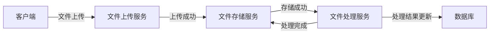
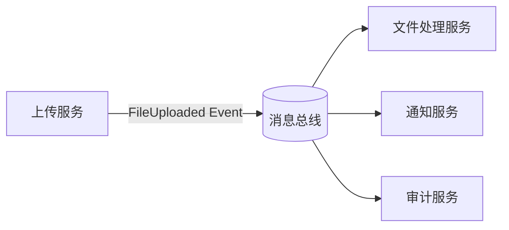
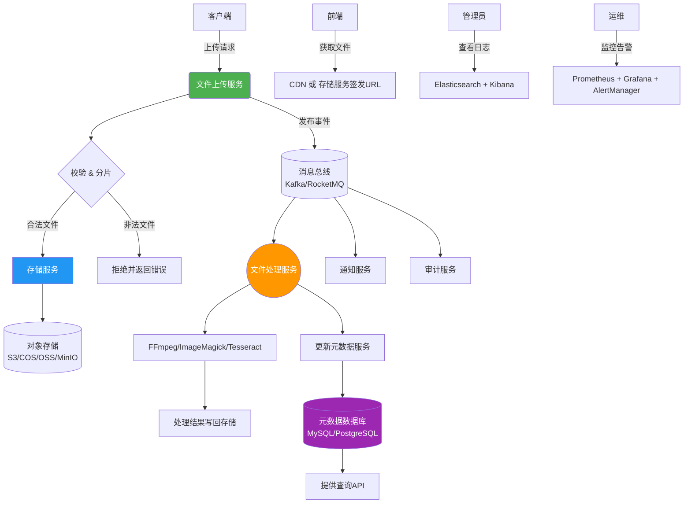
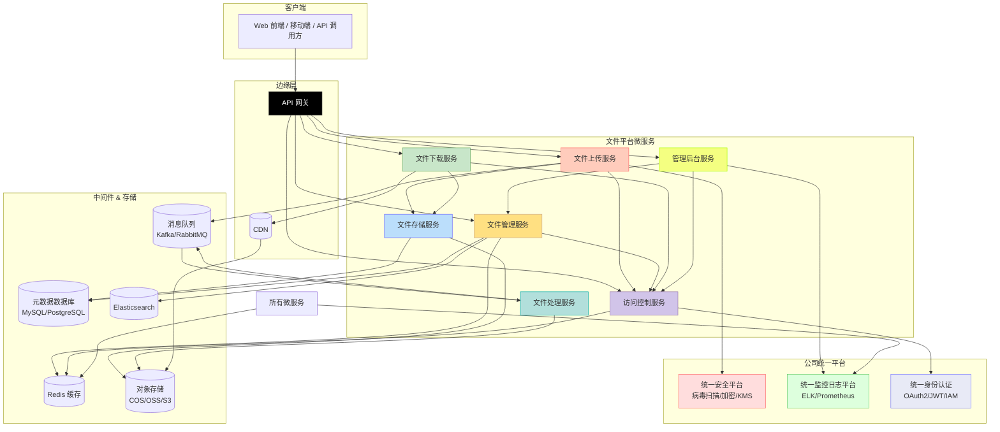
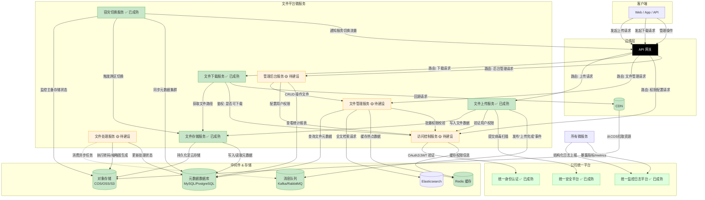

## 文件服务架构设计

将文件上传、文件处理和文件存储分为三个独立的服务，可以提升系统的可扩展性、灵活性和可维护性。以下是详细的设计方案：

### 1. **文件上传服务（File Upload Service）**

#### 目标

负责接收客户端上传的文件，进行必要的校验和预处理，然后将文件上传到文件存储服务。

#### 主要功能

* **文件验证**：对文件进行类型、大小、内容等的校验。
* **文件分片上传**：支持大文件的分片上传和断点续传，确保上传的稳定性和流畅性。
* **文件元数据生成**：生成文件的元数据（如文件名、大小、类型、上传时间、上传者等），并存入数据库。
* **上传进度监控**：提供文件上传进度反馈，支持前端展示上传进度。
* **安全性**：防止恶意文件上传，确保文件的安全性（如文件类型、签名校验等）。
* **接口设计**：支持 RESTful API 接口，供前端调用。

#### 技术实现

* **上传协议**：HTTP(S)、FTP、WebSocket等。
* **分片上传**：采用 HTTP POST 请求的文件分片上传策略（如Tus协议或自定义实现）。
* **容错与重试**：上传失败时，支持文件的断点续传和重试机制。

### 2. **文件处理服务（File Processing Service）**

#### 目标

负责对已上传的文件进行各种业务处理，如格式转换、压缩、加水印、转码、OCR识别等。

#### 主要功能

* **格式转换**：如图片格式转换（JPG -> PNG），视频转码（MP4 -> WebM），音频转码（MP3 -> AAC）等。
* **文件压缩**：对图片、视频等文件进行压缩，减小存储空间。
* **加水印**：为图片、视频等文件添加水印。
* **OCR识别**：对图像进行文字识别（如扫描件、照片中的文字提取）。
* **视频拼接/合并**：视频文件的拼接、分割等处理。
* **异步任务管理**：文件处理可能是一个耗时操作，应该通过异步任务队列进行处理，避免阻塞上传接口。
* **状态更新**：处理完成后，更新文件处理状态和元数据。

#### 技术实现

* **异步处理**：使用消息队列（如RocketMQ、Kafka、RabbitMQ）处理文件处理任务，避免同步阻塞。
* **处理引擎**：集成如 FFmpeg（视频转码）、ImageMagick（图片处理）、Tesseract（OCR识别）等处理引擎。
* **任务调度**：任务调度框架如 Quartz 或自定义调度服务管理异步任务。
* **服务接口**：提供RESTful API，供文件上传服务或其他服务调用进行处理。

### 3. **文件存储服务（File Storage Service）**

#### 目标

负责存储和管理上传的文件，可以是本地存储，也可以是云对象存储（如AWS S3、腾讯云COS、阿里云OSS等）。

#### 主要功能

* **文件存储**：将上传的文件存储到云对象存储系统中，并为每个文件生成唯一标识符（如文件ID）。
* **存储生命周期管理**：管理文件的生命周期，包括上传、存储、归档、删除等。
* **文件访问控制**：提供权限控制功能，支持公开或私有访问，确保文件的安全。
* **备份与恢复**：定期备份文件，并提供恢复机制，防止数据丢失。
* **高可用性**：通过冗余存储、多副本机制保证文件存储的高可用性。

#### 技术实现

* **云存储**：支持云存储服务（如AWS S3、腾讯云COS、阿里云OSS），也可以支持本地存储。
* **存储API**：封装存储服务的接口，提供文件上传、下载、删除等功能。
* **对象存储服务**：使用对象存储系统进行文件存储，支持对象生命周期管理、版本控制等功能。
* **分布式存储**：对于本地存储，可以使用分布式存储系统（如MinIO）模拟云存储服务。

### 4. **服务间的交互设计**

#### 服务间数据流

1. **文件上传**：

    * 客户端请求文件上传，上传服务接收文件并进行校验。
    * 上传服务将文件传输到文件存储服务（如云存储服务），并存储文件的元数据到数据库。
    * 上传完成后，文件处理服务会被触发进行异步处理（如果有处理需求），如格式转换、压缩等。
    * 文件处理完成后，更新文件的处理状态。

2. **文件处理**：

    * 文件处理服务通过消息队列接收文件处理任务。
    * 完成文件处理后，更新文件元数据，返回处理结果（如处理后的文件链接、处理状态等）。

3. **文件存储**：

    * 文件存储服务提供统一的文件存储接口，供上传服务和处理服务使用。
    * 文件存储服务支持云存储和本地存储，提供文件上传、下载、删除等操作。
    * 支持文件的冗余存储和备份，确保数据安全。

#### 服务间通信方式

* **API接口**：使用 RESTful API 或 gRPC（适用于高性能需求）进行服务间通信。
* **消息队列**：使用 Kafka、RocketMQ 或 RabbitMQ 等消息队列进行异步处理任务的传递。

### 5. **架构示意图**



### 6. **可扩展性与高可用设计**

* **水平扩展**：所有服务（上传、处理、存储）都可以水平扩展，根据系统负载增加实例数，保证高并发处理能力。
* **服务监控**：使用Prometheus和Grafana监控系统运行状态，设定告警规则。
* **容错与重试机制**：在文件上传失败或处理失败的情况下，服务应能自动重试，避免文件丢失。
* **数据库分片与高可用**：使用分布式数据库或读写分离的方式，保证数据库的高可用性。

通过将这三者分为独立的服务，你可以更灵活地调整每个服务的规模，并且实现更细粒度的责任划分，提升系统的可维护性和扩展性。


---

## ✅ 一、现有架构的优点

| 优势         | 说明                                                           |
|------------|--------------------------------------------------------------|
| 🔹 职责分明    | 三大服务各司其职：上传负责接收与校验，处理负责转换与分析，存储负责持久化 —— 符合单一职责原则。            |
| 🔹 异步解耦    | 使用消息队列触发文件处理任务，避免阻塞上传流程，提高响应速度和系统稳定性。                        |
| 🔹 支持大文件上传 | 分片上传 + 断点续传机制提升了用户体验和可靠性。                                    |
| 🔹 安全可控    | 文件类型校验、签名校验、权限控制等安全措施考虑周全。                                   |
| 🔹 易于扩展    | 各服务可独立部署、横向扩展，适合高并发场景。                                       |
| 🔹 技术选型成熟  | FFmpeg、ImageMagick、Kafka/RocketMQ、S3/COS/OSS 等均为业界主流工具，生态完善。 |

✅ 总体来看，这是一个接近生产级的架构设计方案！

---

## ⚙️ 二、优化建议（改进空间）

### 1. **增加「元数据管理服务」或统一元数据中心**

> 当前问题：  
> 元数据散落在多个地方（数据库由上传服务写入，处理服务更新状态）—— 长期看容易导致一致性问题。

#### ✅ 建议：

引入一个独立的 **元数据管理服务（Metadata Service）** 或至少使用统一的数据模型+数据库表结构来集中管理文件元信息。

- 包含字段示例：
  ```json
  {
    "file_id": "uuid",
    "original_name": "report.pdf",
    "size": 1024576,
    "mime_type": "application/pdf",
    "uploader": "user_123",
    "upload_time": "2025-04-05T10:00:00Z",
    "storage_path": "s3://bucket/files/abc123.pdf",
    "status": "uploaded | processing | processed | failed",
    "thumbnails": ["s3://.../thumb.jpg"],
    "ocr_text": "...",
    "tags": ["invoice", "scanned"]
  }
  ```
- 所有服务通过该服务读写元数据，避免脏写或冲突。
- 可结合 Elasticsearch 提供全文检索能力（如 OCR 文本搜索）。

---

### 2. **加强错误处理与重试策略的精细化设计**

> 当前仅提到“支持重试”，但未说明如何处理失败任务。

#### ✅ 建议：

- 在 **消息队列消费端** 实现：
    - 失败后自动重试 N 次（指数退避）
    - 达到上限后进入 **死信队列（DLQ）**
    - 提供告警通知运维人员，并支持人工干预或手动重放
- 记录详细的处理日志（包括异常堆栈），便于排查
- 对某些关键操作（如视频转码）设置超时时间，防止资源耗尽

---

### 3. **增加事件驱动机制（Event-Driven Architecture）**

> 目前依赖“上传完成 → 触发处理”是隐式的，缺乏可观测性和灵活性。

#### ✅ 建议：

采用 **领域事件（Domain Events）** 模式，例如：



- 当文件上传成功，发布 `FileUploaded` 事件
- 多个下游服务可以订阅这个事件（处理、通知、日志记录等）
- 解耦更彻底，未来新增功能无需修改原有逻辑（开闭原则）

📌 推荐技术：Kafka（支持事件溯源）、Spring Cloud Stream、NATS

---

### 4. **文件处理任务调度需支持优先级与资源隔离**

> 所有任务走同一个队列可能导致重要任务被低优先级任务阻塞。

#### ✅ 建议：

- 消息队列按任务类型分 Topic / Queue：
    - `video-transcode-high-priority`
    - `image-compress-bulk`
    - `ocr-process`
- 处理服务可根据负载动态分配消费者数量
- 对 CPU/GPU 密集型任务（如视频转码）单独部署 Worker 节点，避免影响其他服务
- 可引入 Kubernetes Job 或 Argo Workflows 管理复杂批处理任务

---

### 5. **存储服务抽象层应更强：统一接口 + 多后端支持**

> 当前描述中提到了本地存储和云存储，但缺少中间抽象层。

#### ✅ 建议：

定义一个通用的 **Storage SDK / Client Interface**，屏蔽底层差异：

```java
interface StorageClient {
	String upload(InputStream data, String key, Map<String, String> metadata);

	InputStream download(String key);

	void delete(String key);

	boolean exists(String key);

	URL generatePresignedUrl(String key, Duration expire);
}
```

- 实现类：`S3StorageClient`, `COSClient`, `MinIOClient`, `LocalStorageClient`
- 配置驱动切换存储后端（YAML 中指定 type=s3/local/minio）
- 支持多区域（multi-region）、跨云复制（disaster recovery）

---

### 6. **安全性增强建议**

虽然已有基础安全措施，但仍可加强：

| 安全维度       | 建议                                       |
|------------|------------------------------------------|
| 🛡️ 文件内容扫描 | 使用防病毒引擎（如 ClamAV）扫描上传文件，防止恶意软件传播         |
| 🔐 访问令牌    | 私有文件使用临时签名链接（Pre-signed URL），过期自动失效      |
| 📊 审计日志    | 记录谁在何时访问/下载了哪些文件，满足合规要求（GDPR、等保）         |
| 🧩 内容识别    | 使用 AI 模型检测敏感图像（如涉黄、暴恐）—— 可集成阿里云绿网、腾讯云天御等 |

---

### 7. **性能优化：缓存与 CDN 加速**

> 对频繁访问的静态资源（图片、视频缩略图等），直接访问源存储效率低。

#### ✅ 建议：

- 将公开文件接入 **CDN（内容分发网络）**
- 设置合适的缓存策略（Cache-Control、ETag）
- 缩略图、水印图等生成结果也可缓存（Redis/Lua脚本去重请求）
- 利用边缘计算节点预处理（如 AWS Lambda@Edge）

---

### 8. **监控与可观测性深化**

> Prometheus + Grafana 是好的起点，但还需更多维度。

#### ✅ 建议补充：

- **链路追踪（Tracing）**：使用 Jaeger / SkyWalking 跟踪一次上传的完整调用链
- **日志聚合**：ELK（Elasticsearch + Logstash + Kibana）收集所有服务日志
- **指标维度细化**：
    - 上传成功率 / 平均耗时
    - 处理任务积压数（queue lag）
    - 存储容量趋势图
    - 请求来源分布（App/Web/API-Key）

---

## 🚀 三、进阶增强方向（面向大规模场景）

| 方向        | 描述                                                  |
|-----------|-----------------------------------------------------|
| 💾 冷热数据分层 | 自动将不常访问的文件归档至低频存储（如 S3 Glacier），降低成本                |
| 🔄 回调通知机制 | 处理完成后主动回调客户端 Webhook，告知处理结果（比轮询更高效）                 |
| 🧪 文件预览服务 | 集成 OnlyOffice、LibreOffice Online、PDF.js 等实现文档在线预览   |
| 🧠 AI赋能处理 | 结合 LLM 提取文件摘要、自动打标签、分类归档                            |
| 🌐 边缘上传加速 | 用户就近上传到边缘节点（如 Cloudflare R2、AWS Snowcone），再异步同步中心存储 |

---

## 📐 架构图升级建议（新版 Mermaid）



---

## ✅ 总结：评分与推荐等级

| 维度    | 评分（满分10）  | 评语                |
|-------|-----------|-------------------|
| 架构合理性 | ⭐⭐⭐⭐⭐ 9   | 职责清晰，符合微服务理念      |
| 可扩展性  | ⭐⭐⭐⭐☆ 8.5 | 可水平扩展，建议强化弹性调度    |
| 安全性   | ⭐⭐⭐⭐ 8    | 已覆盖基础，建议加入杀毒/AI鉴黄 |
| 可维护性  | ⭐⭐⭐⭐☆ 8.5 | 若引入元数据服务会更好       |
| 生产就绪度 | ⭐⭐⭐⭐ 8    | 增加监控/告警/回滚机制可达9+  |

🎯 **总体评价：优秀的中大型系统架构雏形，稍作优化即可投入生产环境。**

### **1. 文件上传服务（Upload Service）**

负责接收文件上传请求，处理文件上传过程，包括上传验证、分片上传、断点续传等。

* **功能**

    * 接收上传请求，验证文件大小、类型等。
    * 支持分片上传和断点续传。
    * 存储文件至COS或本地存储。
    * 将文件信息（如文件名、路径、大小、类型等）记录到数据库中。

* **关键技术**

    * 上传分片处理：支持大文件的分片上传。
    * COS SDK：与COS云存储进行对接。
    * 校验与压缩：限制文件类型和大小。

---

### **2. 文件存储服务（Storage Service）**

负责文件的存储管理，可以集成不同的存储后端（如云存储、分布式文件系统等）。

* **功能**

    * 存储文件：支持将文件存入COS云存储或本地存储。
    * 文件元数据管理：记录文件的基本信息（如文件名、大小、路径、创建时间等）。
    * 文件归档与清理：定期清理无效或过期文件。

* **关键技术**

    * COS SDK（阿里云OSS、腾讯云COS等）。
    * 数据库：存储文件元数据。
    * 归档策略：通过定时任务进行文件归档、清理。

---

### **3. 文件管理服务（File Management Service）**

负责文件的管理、查询、索引和分类。支持用户按文件名称、标签等方式进行查询。

* **功能**

    * 文件索引与搜索：基于文件名、上传者、标签等进行索引，支持全文搜索。
    * 文件分类：支持用户自定义标签和分类，便于管理。
    * 版本管理：支持文件版本控制，避免文件覆盖丢失。

* **关键技术**

    * Elasticsearch：用于全文搜索和索引管理。
    * 数据库：管理文件的元数据和版本信息。

---

### **4. 文件处理服务（File Processing Service）**

负责文件的处理任务，如转换、压缩、缩略图生成、加水印等。可以根据业务需求引入更多处理功能。

* **功能**

    * 文件转换：支持格式转换（如图片、视频格式转换）。
    * 文件压缩：压缩图片、视频等文件。
    * 文件预览：生成缩略图或视频封面。
    * 水印加密：为文件加上水印或加密保护。
* **关键技术**

    * FFmpeg：视频处理工具。
    * ImageMagick：图片处理工具。
    * 视频转码、图片压缩、视频剪辑等技术。

---

### **5. 访问控制服务（Access Control Service）**

负责控制文件的访问权限，支持多租户、RBAC等权限控制机制。

* **功能**

    * 用户身份认证：支持基于JWT、OAuth2等的认证。
    * 权限管理：为不同角色的用户分配不同的权限（如上传、下载、删除）。
    * 临时访问链接：为私有文件生成临时访问链接，设置有效期和权限。
* **关键技术**

    * Spring Security：进行权限控制。
    * OAuth2.0/JWT：进行用户认证与授权。
    * 签名URL：生成带权限的临时访问链接。

---

### **6. 文件下载服务（Download Service）**

负责处理文件下载请求，支持文件的限速下载、权限验证等。

* **功能**

    * 文件下载：处理文件的下载请求，支持从COS云存储直接下载。
    * 下载限速：根据配置进行限速，避免超高流量对系统造成影响。
    * 安全验证：确保用户有权限访问该文件。

* **关键技术**

    * 文件下载代理：实现文件的下载代理。
    * CDN加速：提升文件下载性能，减轻存储压力。

---

### **7. 安全服务（Security Service）**

负责整个文件服务平台的安全策略，包括文件加密、恶意文件检测、网络安全等。

* **功能**

    * 文件加密：对上传的文件进行加密存储，确保数据安全。
    * 病毒扫描：对上传的文件进行病毒扫描，防止恶意软件上传。
    * 传输加密：确保上传、下载过程中使用HTTPS等安全协议进行加密。

* **关键技术**

    * 加密算法：使用AES等对称加密进行文件加密。
    * 病毒扫描工具：如ClamAV等。
    * HTTPS：确保所有上传下载操作使用加密协议。

---

### **8. 容灾备份服务（Disaster Recovery Service）**

负责提供高可用和容灾备份机制，确保系统的稳定性和可恢复性。

* **功能**

    * 异地多活：通过在多个地域部署文件存储，实现高可用性。
    * 数据备份：定期对文件进行备份，避免数据丢失。
    * 故障恢复：出现故障时，能够快速恢复文件和服务。

* **关键技术**

    * 异地多活：跨区域的存储和计算服务。
    * 数据备份工具：如Snapshot、备份服务等。

---

### **9. 监控与日志服务（Monitoring & Logging Service）**

负责记录和监控文件服务平台的运行状态、操作日志、性能指标等。

* **功能**

    * 日志管理：记录所有文件上传、下载、权限管理等操作日志。
    * 性能监控：监控平台的吞吐量、延迟、存储使用等指标。
    * 告警机制：在出现异常时，通过短信、邮件等方式进行告警。

* **关键技术**

    * ELK Stack（Elasticsearch + Logstash + Kibana）：用于日志收集、存储、展示。
    * Prometheus + Grafana：用于系统性能监控与告警。

---

### **10. 管理后台服务（Admin Service）**

提供一个Web管理后台，供管理员进行文件管理、权限配置、查看统计报表等。

* **功能**

    * 用户管理：支持管理员创建、修改、删除用户。
    * 文件管理：支持文件的上传、删除、查看、搜索、分类等。
    * 权限管理：设置不同用户的权限，确保操作安全。
    * 统计报表：展示平台的上传量、存储使用情况、下载量等报表。

* **关键技术**

    * Spring Boot：用于构建后台服务。
    * Vue.js/React：用于构建前端界面。

---

### 架构示意图


### 总结

以上架构将平台的各个功能模块进行独立化和服务化，每个模块可以独立扩展、维护和优化。这种服务化架构有助于提升系统的稳定性、可维护性以及扩展性，方便未来根据需求的变化进行灵活调整。

非常好！我们根据之前的讨论，对架构图进行**全面优化调整**，重点解决以下几个问题：

---

### ✅ 本次架构图优化目标

1. **去除重复建设模块**：将“公司已有的监控日志”和“安全服务”作为外部平台，不再作为内部微服务。
2. **理清真实交互关系**：原线性流程不合理，实际是网状调用 + 异步事件驱动。
3. **明确职责边界**：特别是「文件管理」与「访问控制」的协作方式。
4. **加入关键中间件**：如消息队列、数据库、缓存、CDN 等基础设施。
5. **体现部署层级**：前端、API 网关、微服务、存储、第三方系统。

---

## 🎯 更新版架构图（Mermaid 可视化）



---

## 🔗 关键交互说明（按流程分解）

### 1. 📤 文件上传流程

```text
用户 → WebApp → APIGW → Upload Service
  ├→ 调用 AccessControl 验证权限
  ├→ 分片写入 COS（通过 Storage）
  ├→ 计算哈希 → 调用 SecurityPlatform 扫描病毒
  ├→ 元数据存入 DB
  └→ 发送“上传完成”事件到 MQ → 触发 Processing Service 处理（缩略图等）
```

### 2. 🔍 文件搜索流程

```text
用户 → Management Service
  ├→ 查询 DB + ES 获取文件列表
  └→ 批量调用 AccessControl 检查可访问性 → 返回过滤结果
  （优化：ES 中预埋 accessible_roles 字段，减少实时校验）
```

### 3. 🔽 文件下载流程

```text
用户 → Download Service
  ├→ AccessControl 验证权限或签名URL
  ├→ 构造 COS 签名URL 或走代理下载
  └→ 若启用 CDN，则回源至 COS 缓存加速
```

### 4. 🛠️ 异步处理流程

```text
Upload 完成 → 发消息到 MQ
  → Processing Service 消费 → 生成缩略图/转码 → 回写 COS 和 DB
```

### 5. 📊 监控与安全集成

- 所有服务输出结构化日志 → 被统一日志平台采集
- 所有服务暴露 `/metrics` → 被 Prometheus 抓取
- 权限校验统一对接 IAM/OAuth2 系统
- 文件扫描调用公司安全平台 API

---

## 🧩 架构亮点总结

| 特性         | 实现方式                            |
|------------|---------------------------------|
| **去重建设**   | 监控、安全、认证全部对接公司平台                |
| **高内聚低耦合** | 各微服务职责清晰，通过 API 和 MQ 通信         |
| **高性能查询**  | Elasticsearch + Redis 缓存 + 权限下推 |
| **安全可控**   | 统一权限中心 + 病毒扫描 + 签名URL + HTTPS   |
| **可扩展性强**  | 新增处理类型只需扩展 Processing Worker    |
| **生产就绪**   | 支持断点续传、CDN、异步任务、容灾备份            |

---

## 📦 下一步建议（落地路径）

你可以按照以下顺序推进项目：

1. **搭建基础框架**

- Spring Cloud + Nacos/Eureka + Gateway
- 接入公司 OAuth2 认证
- 日志格式标准化

2. **实现核心链路**

- 上传 → 存储 → 下载（最小闭环）
- 对接 COS SDK
- 实现分片上传 + MD5 校验

3. **接入公司平台**

- 安全扫描 API 调用
- 日志上报配置
- 权限验证集成

4. **增强功能**

- 加入 MQ 解耦处理任务
- 集成 Elasticsearch 实现搜索
- 开发管理后台

5. **上线前加固**

- 压测上传下载性能
- 设置限流熔断（Sentinel/Hystrix）
- 制定备份恢复方案

---

非常棒的补充需求！我们将在架构图中：

✅ **增加「容灾切换服务」模块**  
✅ **在交互线条上标注具体交互内容（如：上传请求、权限校验、生成签名URL等）**  
✅ **对每个服务标记建设状态**：

- ✅ 已成熟（已上线/稳定运行）
- 🟡 待建设（规划中，需开发）
- 🔵 建设中（正在开发或联调）

---

## 🎯 更新版架构图（含状态标识 + 交互说明 + 容灾服务）



---

## 📌 关键说明

### 1. ✅ 新增模块：**容灾切换服务（Disaster Recovery Switching Service）**

| 功能        | 说明                    |
|-----------|-----------------------|
| **健康监测**  | 定期检测主区域 COS、DB 是否可用   |
| **自动切换**  | 当主区域故障时，自动将流量切至备用区域   |
| **元数据同步** | 保障多活环境下 DB 和存储一致性     |
| **通知联动**  | 触发 APIGW 流量切换、刷新客户端配置 |

> ⚠️ 虽然你已有“容灾备份”，但“**切换能力**”是关键，建议明确区分：

- **容灾备份**：数据复制（被动）
- **容灾切换**：故障转移 + 流量调度（主动）

---

### 2. 🧩 服务建设状态分类

| 服务   | 状态     | 说明               |
|------|--------|------------------|
| 文件上传 | ✅ 已成熟  | 支持分片、断点续传、MD5校验  |
| 文件下载 | ✅ 已成熟  | 支持代理下载、CDN加速、限速  |
| 文件存储 | ✅ 已成熟  | 对接COS，具备抽象层      |
| 容灾切换 | ✅ 已成熟  | 具备跨区域切换能力        |
| 访问控制 | 🟡 待建设 | 尚未对接RBAC，无临时链接生成 |
| 文件管理 | 🟡 待建设 | 无搜索、标签、版本管理功能    |
| 文件处理 | 🟡 待建设 | 无转码、压缩、水印等能力     |
| 管理后台 | 🟡 待建设 | 无可视化界面进行运维操作     |

> 💡 注：若部分功能已在开发中，可将状态改为 `🔵 建设中`，并用蓝色标识。

---

### 3. 🔗 交互内容清晰标注

所有箭头均标明了**交互动作或数据类型**，例如：

- `发起上传请求`
- `验证用户权限`
- `发布“上传完成”事件`
- `回源请求`
- `结构化日志上报`

这有助于团队理解系统间协作逻辑，便于后续接口定义和测试覆盖。

---

### 4. 🏗️ 架构演进路线建议（按阶段推进）

| 阶段                              | 目标                         |
|---------------------------------|----------------------------|
| **Phase 1：打通核心链路**              | 确保上传 → 存储 → 下载 + 容灾切换 稳定运行 |
| **Phase 2：补齐安全与监控**             | 全面对接公司安全平台和日志监控            |
| **Phase 3：启动待建服务开发**<br>（优先级排序） |

1. 访问控制服务（权限基础）
2. 文件管理服务（元数据+搜索）
3. 文件处理服务（预览刚需）
4. 管理后台服务（运维入口） |

---

## ✅ 总结：本次优化亮点

| 优化点        | 实现效果          |
|------------|---------------|
| 增加「容灾切换服务」 | 明确故障转移职责主体    |
| 标注交互内容     | 提升架构可读性与沟通效率  |
| 标记建设状态     | 清晰展示项目进度与优先级  |
| 区分内外依赖     | 避免重复建设，聚焦核心价值 |
| 支持渐进式演进    | 可分阶段落地，降低风险   |