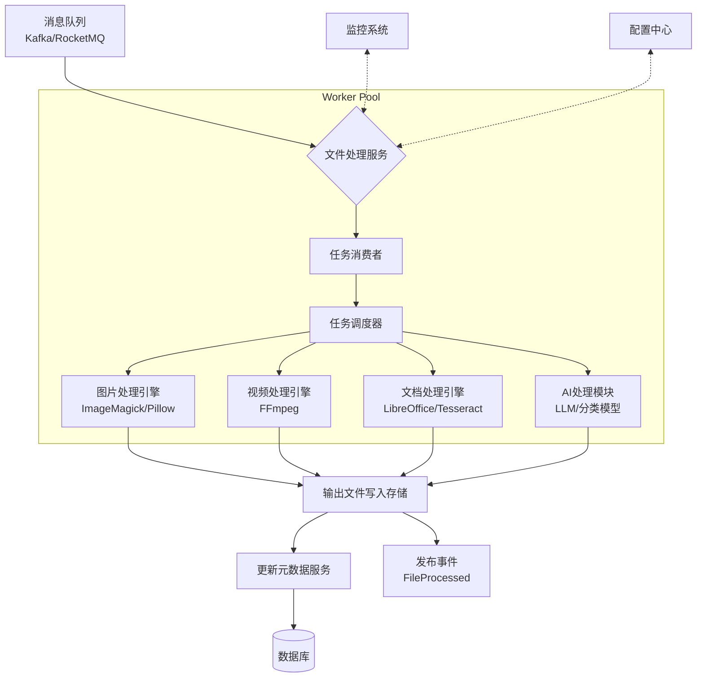

设计一个**健壮、可扩展、高可用的文件处理服务（File Processing Service）**
，是构建现代文件系统架构中的关键一环。它不仅要能高效执行各类文件转换任务，还要具备良好的容错性、可观测性和异步调度能力。

下面我将从 **目标定位、核心职责、架构设计、技术选型、模块划分、性能优化与生产实践建议** 等多个维度，为你详细阐述如何系统化地设计“文件处理服务”。

---

## 🎯 一、文件处理服务的目标

> 将上传后的原始文件，根据业务需求进行自动化处理，生成新的衍生内容或提取有价值的信息。

### 核心目标：

- ✅ **解耦上传流程**：不阻塞用户上传体验
- ✅ **支持多种处理类型**：格式转换、压缩、OCR、水印等
- ✅ **异步可靠执行**：失败可重试、状态可追踪
- ✅ **资源隔离与弹性伸缩**：避免 CPU/GPU 密集型任务影响其他服务
- ✅ **可观测性强**：监控任务进度、成功率、耗时等指标

---

## 🧩 二、核心功能模块设计

| 模块                          | 功能说明                              |
|-----------------------------|-----------------------------------|
| 1. 任务接收器（Task Consumer）     | 从消息队列中消费待处理任务                     |
| 2. 任务调度器（Scheduler）         | 决定任务优先级、并发度、超时控制                  |
| 3. 处理引擎（Processing Engine）  | 调用具体工具执行处理逻辑（如 FFmpeg）            |
| 4. 状态管理器（Status Manager）    | 更新任务状态（processing → success/fail） |
| 5. 回调通知（Callback/Event）     | 处理完成后通知上游或其他服务                    |
| 6. 日志与监控（Logging & Metrics） | 记录日志、上报指标、链路追踪                    |

---

## 🔗 三、整体架构图（Mermaid）



---

## ⚙️ 四、关键技术组件详解

### 1. **任务来源：消息驱动（Message-Driven）**

#### 使用场景：

- 文件上传完成后，由上传服务发送一条 `FileUploaded` 消息到 Kafka/RocketMQ。
- 文件处理服务监听该 Topic，拉取任务并开始处理。

#### 示例消息结构：

```json
{
  "file_id": "f_123456",
  "original_url": "https://storage.example.com/uploads/report.pdf",
  "operations": [
    {
      "type": "convert",
      "from": "pdf",
      "to": "png",
      "pages": [
        1
      ]
    },
    {
      "type": "ocr",
      "language": "zh"
    },
    {
      "type": "compress",
      "target_size_kb": 500
    }
  ],
  "callback_url": "https://client.com/hook/file-ready"
}
```

> ✅ 支持灵活的任务组合和回调机制。

---

### 2. **任务调度与执行策略**

#### （1）任务队列分级

| 队列类型          | 用途            | 示例          |
|---------------|---------------|-------------|
| high-priority | VIP 用户上传的紧急任务 | 视频直播封面生成    |
| default       | 普通用户任务        | 图片缩略图生成     |
| bulk          | 批量后台任务        | 历史文档 OCR 扫描 |

> 可通过 RabbitMQ 的 multiple queues 或 Kafka 的 partition + consumer group 实现。

#### （2）并发控制

- 配置最大 worker 数量（如每节点 4 个并发）
- 使用线程池或协程池管理执行单元
- 对 GPU 任务单独分配专用节点（K8s taint/toleration）

#### （3）超时与熔断

- 单个任务最长运行时间（如视频转码不超过 5 分钟）
- 超时后标记为失败，进入死信队列（DLQ）
- 连续失败达到阈值时自动暂停队列消费并告警

---

### 3. **处理引擎集成方式**

| 类型         | 工具                                  | 接入方式                |
|------------|-------------------------------------|---------------------|
| 图像处理       | ImageMagick, Pillow, GraphicsMagick | CLI 调用或库调用          |
| 视频/音频      | FFmpeg                              | 执行命令行脚本             |
| PDF/Office | LibreOffice, Pandoc, Apache POI     | 启动 headless 服务      |
| OCR        | Tesseract, PaddleOCR, 百度OCR API     | SDK 或 REST API      |
| AI增强       | 自研模型 / HuggingFace / LangChain      | Python Microservice |
| 压缩         | zlib, jpegoptim, pngquant           | CLI 或内置库            |

📌 建议封装成统一接口：

```python
class Processor:
    def process(self, input_path: str, output_dir: str, params: dict) -> ProcessResult:
        pass

class ImageConverter(Processor): ...
class VideoTranscoder(Processor): ...
class OCREngine(Processor): ...
```

---

### 4. **文件下载与上传管理**

#### 下载原始文件：

- 从对象存储（S3/COS/OSS）使用 Pre-signed URL 下载
- 加入本地缓存目录（如 `/tmp/process/f_123456`），防止重复下载
- 设置本地磁盘清理策略（定时删除临时文件）

#### 上传结果文件：

- 处理完成后，将输出文件重新上传至存储服务
- 生成新路径（如 `processed/{file_id}/thumbnail.jpg`）
- 返回处理结果元数据（URL、尺寸、MD5、页数等）

---

### 5. **状态管理与元数据更新**

#### 状态机设计：

```text
uploaded → processing → [success / failed / retrying]
                     ↘ cancelled (可支持手动取消)
```

#### 元数据更新流程：

1. 开始处理：设置 `status=processing`, `started_at=now`
2. 成功完成：写入 `output_urls=["..."]`, `ocr_text="..."`, `status=processed`
3. 失败：记录 `error_msg`, `retry_count`, `status=failed`

> 更新操作应通过 **元数据服务 API** 完成，避免直接访问 DB。

---

### 6. **回调与事件通知机制**

#### 方式一：HTTP Webhook 回调

```json
POST https://client.com/callback
{
"event": "file.processed",
"file_id": "f_123456",
"status": "success",
"results": {
"thumbnail_url": "...",
"text_content": "这是一份发票..."
},
"timestamp": "2025-04-05T12:00:00Z"
}
```

- 支持重试机制（最多3次）
- 提供签名验证（HMAC-SHA256）确保安全性

#### 方式二：发布领域事件

- 发布 `FileProcessed` 到消息总线
- 其他服务订阅（如搜索服务索引文本、通知服务发邮件）

---

## 📈 五、性能与可靠性优化

| 优化点       | 实现方式                           |
|-----------|--------------------------------|
| 🔁 幂等性保证  | 每个任务带唯一 ID，防止重复处理              |
| 💤 本地缓存加速 | 使用 Redis 缓存已处理过的文件指纹（MD5+操作类型） |
| 🧊 临时文件管理 | 使用内存文件系统（tmpfs）或 SSD 存储中间文件    |
| 📦 批处理模式  | 对批量小图进行合并处理（如一次生成多个缩略图）        |
| 🪐 边缘计算   | 在离用户近的边缘节点做轻量处理（如缩放、裁剪）        |
| 🔄 断点续传   | 对大文件处理支持中间 checkpoint（如视频分段转码） |

---

## 🛡️ 六、安全与合规考虑

| 安全项   | 措施                        |
|-------|---------------------------|
| 沙箱执行  | 敏感操作在容器或 VM 中运行，限制权限      |
| 防病毒扫描 | 使用 ClamAV 扫描输入/输出文件       |
| 内容审核  | 调用第三方鉴黄/暴恐检测接口（阿里绿网、腾讯天御） |
| 数据脱敏  | OCR 结果中敏感信息打码（身份证号、手机号）   |
| 权限校验  | 处理前确认用户是否有权访问该文件          |

---

## 📊 七、监控与可观测性

| 监控维度      | 工具建议                              |
|-----------|-----------------------------------|
| 任务数量 & 积压 | Kafka Lag Monitor, Prometheus     |
| 处理成功率     | Grafana dashboard + alert rules   |
| 平均处理时间    | Micrometer + Timer metrics        |
| 错误日志分析    | ELK / Loki + Promtail             |
| 链路追踪      | Jaeger / SkyWalking（traceId贯穿全流程） |
| 报警机制      | AlertManager 发送钉钉/企业微信/邮件         |

📌 关键指标示例：

- `file_processing_duration_seconds{operation="ocr"}`
- `file_processing_tasks_total{status="success"}`
- `queue_length{queue="video-transcode"}`

---

## 🚀 八、部署与运维建议

### 1. **部署模式**

- 微服务独立部署，基于 Spring Boot / Go / Node.js / Python FastAPI
- 使用 Docker + Kubernetes 编排，支持自动扩缩容（HPA）

### 2. **资源隔离**

- CPU 密集型任务（转码）部署在高性能实例
- GPU 任务使用专用 GPU 节点（NVIDIA Tesla T4/A100）
- 普通任务使用通用型 ECS/K8s Pod

### 3. **灰度发布**

- 新版本先处理少量流量，观察成功率和资源消耗
- 支持按 `file_type` 或 `user_tier` 进行路由分流

---

## ✅ 九、典型应用场景举例

| 场景        | 处理流程                      |
|-----------|---------------------------|
| 用户上传头像    | 裁剪为 200x200 PNG + WebP 备份 |
| 上传 PDF 合同 | 第一页转缩略图 + OCR 提取关键词       |
| 视频课程上传    | 转码为 HLS 格式 + 自动生成字幕       |
| 扫描件归档     | 去噪增强 + OCR 文本提取 + 存入搜索引擎  |
| 图片社交平台    | 添加水印 + 生成不同分辨率版本用于 CDN 分发 |

---

## 🧩 十、代码结构建议（以 Java/Spring Boot 为例）

```
file-processing-service/
├── controller/               # 接收健康检查等请求（非核心）
├── consumer/                 # MQ 消费者，拉取任务
│   └── FileUploadEventConsumer.java
├── service/
│   ├── FileProcessingService.java      # 主入口
│   ├── impl/ImageProcessingEngine.java
│   ├── impl/VideoTranscodingEngine.java
│   └── MetadataClient.java             # 调用元数据服务
├── model/
│   ├── FileTask.java
│   └── ProcessOperation.java
├── config/
│   ├── KafkaConfig.java
│   └── StorageConfig.java
├── util/
│   ├── LocalTempFileManager.java
│   └── CommandExecutor.java            # 执行 FFmpeg 等命令
└── Application.java
```

---

## ✅ 总结：优秀文件处理服务的关键特征

| 特征       | 如何体现                           |
|----------|--------------------------------|
| ✔️ 异步非阻塞 | 基于消息队列，不影响上传体验                 |
| ✔️ 插件化处理 | 易于新增处理器（Open-Closed Principle） |
| ✔️ 高可靠性  | 重试 + 死信队列 + 告警                 |
| ✔️ 易于扩展  | 可水平扩容 Worker 节点                |
| ✔️ 可观测   | 全链路监控 + 日志追踪                   |
| ✔️ 安全可控  | 沙箱 + 杀毒 + 审核                   |

---

## 📣 最后建议

如果你正在设计这样一个服务，推荐采用以下技术栈组合（生产级）：

| 组件    | 推荐方案                                     |
|-------|------------------------------------------|
| 编程语言  | Java / Go / Python（视团队熟悉度）               |
| 消息队列  | Kafka / RocketMQ（高吞吐）、RabbitMQ（简单场景）     |
| 存储客户端 | AWS SDK / Tencent COS SDK / MinIO Client |
| 任务调度  | Quartz（轻量） / Airflow（复杂 DAG）             |
| 容器化   | Docker + Kubernetes + Helm               |
| 监控    | Prometheus + Grafana + ELK + Jaeger      |


