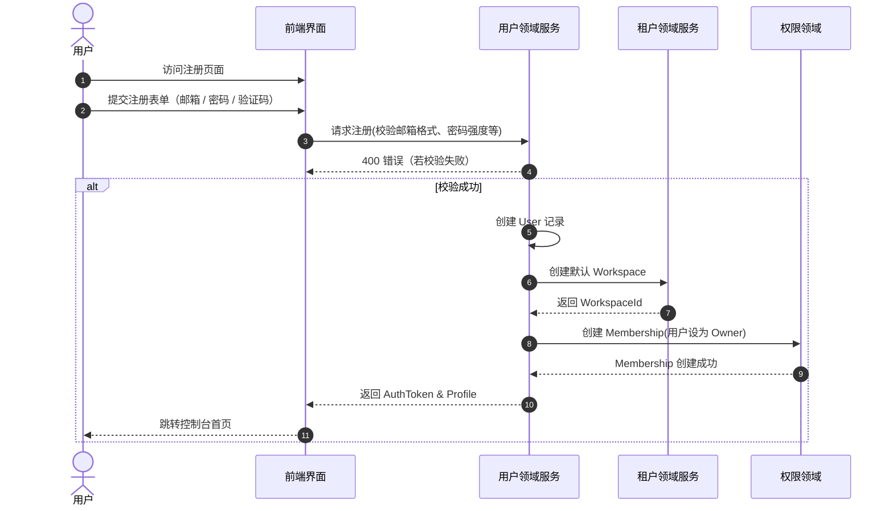
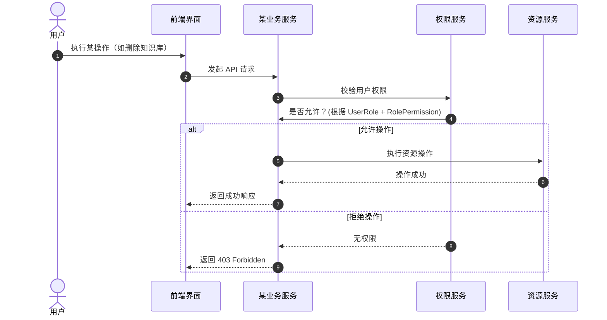
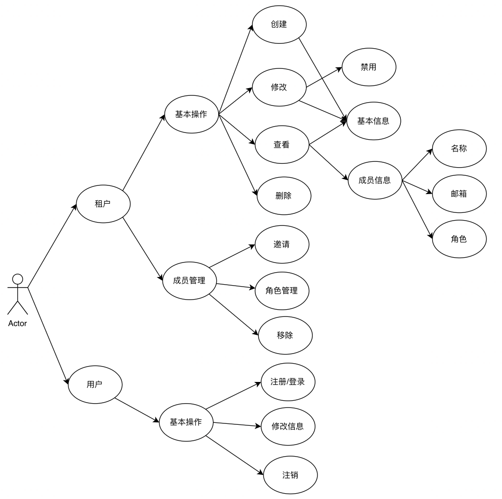
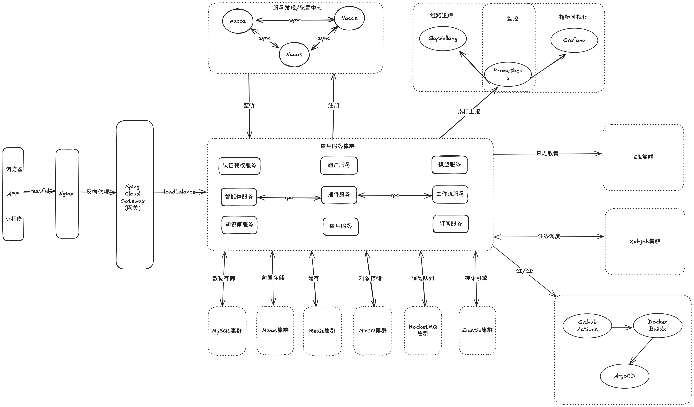

# 一期功能设计

## 一、项目概述

### 1.1 背景【可选】

**说明**：简要介绍项目起因、业务现状及挑战。
**示例**：

> 当前客服系统无智能问答能力，导致运营成本高、响应时长长，需接入大模型提升自动化水平。

### 1.2 项目目标及收益【可选】

**说明**：明确项目要达成的业务或技术目标，并量化收益。
**示例**：

* **响应时长**：由平均2分钟降低至10秒以内
* **成本**：客服人工成本降低30%

### 1.3 名词解释【可选】

**说明**：对文档中出现的专业术语或缩写进行统一定义。
**示例**：

| 术语   | 含义                        |
|------|---------------------------|
| LLM  | Large Language Model      |
| RBAC | Role-Based Access Control |

### 1.4 关联文档【可选】

**说明**：列出 MRD、PRD、接口规范等相关文档及链接。
**示例**：

| 序号 | 文档类型   | 链接         | 备注           |
|----|--------|------------|--------------|
| 1  | MRD    | wiki/xxx   | 市场需求说明       |
| 2  | PRD    | wiki/yyy   | 产品需求说明       |
| 3  | API 文档 | swagger 地址 | RESTful 接口规范 |

---

## 二、需求分析

### 2.1 业务流程

#### **用户注册**



#### **操作资源**



### 2.2 核心用例【必填】

#### **租户用例**



### 2.3 功能列表【必填】

**说明**：结合用例，按领域/模块列出功能点及说明。
**示例**：

| 模块   | 功能   | 说明        |
|------|------|-----------|
| 租户管理 | 基本操作 | 支持租户的增删改查 |
|      | 成员管理 | 支持添加/移除成员 |
| 权限管理 | 角色管理 | 支持角色的增删改查 |
|      | 权限分配 | 支持为角色分配权限 |
|      | 资源权限 | 为资源绑定权限   |

---

## 三、系统设计

### 3.1 技术选型【可选】

* **对比维度**：成熟度、社区支持、性能、成本
* **示例**：

    * RPC：gRPC vs. RESTful，选 gRPC 支持双向流和更低延迟
    * 配置中心：Nacos vs. Consul，选 Nacos 统一注册与配置管理

### 3.2 整体架构【必填】

**说明**：展示分层（接入层、业务层、数据层）、各服务及基础设施的交互拓扑。


### 3.3 领域划分【必填】

**说明**：基于 DDD 限界上下文，定义子域（核心域、支撑域、通用域）。

### 3.4 上下游交互【必填】

**说明**：与外部系统或第三方服务（如支付、权限、监控）的交互流程与数据格式。

### 3.5 服务划分【必填】

**说明**：列出微服务清单、职责、部署单元。
**示例**：

```
- auth-service: 用户鉴权
- chat-service: 会话处理
- vector-service: 向量检索
```

### 3.6 领域模型【必填】

**说明**：绘制领域模型图（类图），标注聚合根、实体、值对象。

### 3.7 核心状态机【必填】

**说明**：对关键实体（如会话）的状态流转图和触发条件。

---

## 四、详细设计

### 4.1 流程与时序【必填】

* **活动图**：描述流程分支、并行与异常处理。
* **时序图**：展示系统调用链路。

### 4.2 数据库设计【必填】

* **ER 图**：核心表关系
* **表结构**：字段、类型、约束
* **历史数据迁移**：兼容方案或脚本示例

### 4.3 数据模型设计【必填】

**说明**：包括缓存（Redis）、消息（MQ）、向量存储（Milvus）等模型结构。

### 4.4 容量与性能评估【必填】

* 预估 QPS、数据量、存储需求
* 分库分表、分片策略示例

### 4.5 配置管理【必填】

**说明**：配置中心方案、配置项示例及灰度发布策略。

### 4.6 定时任务【必填】

**说明**：任务列表、调度规则、依赖关系及时序图。

### 4.7 消息设计【必填】

**说明**：列出 Topic、消息结构、验证与重试规则、消费策略。

### 4.8 接口设计【必填】

**说明**：使用 OpenAPI/Swagger 定义主要服务接口，包括路径、参数、返回体、错误码。
**示例**：

```yaml
paths:
  /chat:
    post:
      summary: 发起会话
      requestBody:
        content:
          application/json:
            schema:
              $ref: '#/components/schemas/ChatRequest'
      responses:
        '200':
          description: 成功
```

---

## 五、非功能性需求

### 5.1 稳定性

* 熔断、限流、重试配置示例

### 5.2 安全性与权限

* RBAC 设计、JWT 策略、审计日志方案

### 5.3 性能优化

* 缓存架构、索引设计、JVM 调优示例

### 5.4 可扩展与可维护

* 模块化设计、接口抽象、自动化测试策略

### 5.5 上线策略【必填】

#### 5.5.1 部署方案

**说明**：发布顺序及步骤。
**示例**：

1. 部署 auth-service
2. 部署 chat-service
3. 部署 gateway

#### 5.5.2 灰度方案

**说明**：灰度流量引导、阶段划分及问题回收机制。

#### 5.5.3 回滚方案

**说明**：回滚条件、回滚脚本与数据恢复策略。

---

## 六、任务分解与排期【可选】

**说明**：结合里程碑，将各模块、功能点分配开发人员及时间。

## 七、技术评审【可选】

**说明**：评审记录、参与人员、决策结果、待决问题。
