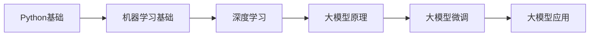

# 🧠 大模型算法工程师学习计划（180天）

> **作者：** 哦，我的朋友  
> **目标：** 从Java后端工程师 → 大模型算法工程师  
> **周期：** 180天（约6个月）  
> **最后更新：** 2024-10-21

---

## 📌 一、学习路线概览

### 阶段划分

| 阶段 | 时间 | 核心内容 | 产出 |
|------|------|----------|------|
| **阶段一** | Day 1-30 | Python + 数学基础 + 机器学习 | 完成基础算法实现 |
| **阶段二** | Day 31-60 | 深度学习框架 + NLP基础 | 搭建神经网络模型 |
| **阶段三** | Day 61-120 | Transformer + 大模型原理 | 理解LLM架构 |
| **阶段四** | Day 121-150 | 模型微调 + 对齐技术 | 完成模型微调项目 |
| **阶段五** | Day 151-180 | 工程实践 + 项目落地 | 产出完整项目 |

---

## 🎯 阶段一：基础打牢（Day 1-30）

### 第一周（Day 1-7）：Python编程

**目标**：掌握Python核心语法与科学计算库

**学习内容**：
1. Python核心语法（3天）
   - 数据类型、控制流、函数、类
   - 装饰器、生成器、上下文管理器
   - 异常处理、文件操作

2. NumPy与矩阵运算（2天）
   - 数组创建与索引
   - 矩阵运算、广播机制
   - 线性代数操作

3. Pandas数据处理（2天）
   - DataFrame操作
   - 数据清洗与预处理
   - 数据可视化基础

**实践项目**：
- 实现矩阵运算库
- 完成数据清洗小项目

### 第二周（Day 8-14）：数学基础

**目标**：掌握机器学习必备数学知识

**学习内容**：
1. 线性代数（3天）
   - 向量、矩阵运算
   - 特征值、特征向量
   - SVD分解

2. 概率论与统计（2天）
   - 概率分布、贝叶斯定理
   - 期望、方差、协方差
   - 最大似然估计

3. 微积分与优化（2天）
   - 梯度、偏导数
   - 梯度下降法
   - 凸优化基础

**实践项目**：
- 手写梯度下降优化器
- 实现简单的最小二乘法

### 第三周（Day 15-21）：机器学习基础

**目标**：理解经典机器学习算法

**学习内容**：
1. 监督学习（4天）
   - 线性回归、逻辑回归
   - 决策树、随机森林
   - SVM支持向量机

2. 非监督学习（2天）
   - K-means聚类
   - PCA降维
   - 异常检测

3. 模型评估与调优（1天）
   - 交叉验证
   - 过拟合与欠拟合
   - 正则化技术

**实践项目**：
- 从零实现线性回归
- 完成Kaggle入门竞赛

### 第四周（Day 22-30）：深度学习入门

**目标**：理解神经网络基础

**学习内容**：
1. 神经网络基础（3天）
   - 感知机、多层感知机
   - 反向传播算法
   - 激活函数

2. PyTorch框架（4天）
   - Tensor操作
   - 自动微分机制
   - 模型构建与训练

3. 优化技巧（2天）
   - 优化器（SGD、Adam）
   - 学习率调度
   - Batch Normalization

**实践项目**：
- 手写反向传播
- 实现简单的MLP分类器

---

## 🚀 阶段二：深度学习进阶（Day 31-60）

### 第五周（Day 31-37）：卷积神经网络

**学习内容**：
- CNN原理与结构
- 经典架构（LeNet、VGG、ResNet）
- 迁移学习

**实践项目**：
- 实现图像分类器
- 微调预训练模型

### 第六周（Day 38-44）：循环神经网络

**学习内容**：
- RNN、LSTM、GRU原理
- 序列建模技术
- 注意力机制初探

**实践项目**：
- 实现文本生成模型
- 完成情感分析任务

### 第七周（Day 45-51）：NLP基础

**学习内容**：
- 词向量（Word2Vec、GloVe）
- 文本预处理与分词
- N-gram语言模型

**实践项目**：
- 训练词向量
- 实现简单的文本分类

### 第八周（Day 52-60）：Transformer架构

**学习内容**：
- Self-Attention机制
- Multi-Head Attention
- Positional Encoding
- Transformer完整结构

**实践项目**：
- 从零实现Transformer
- 完成机器翻译任务

---

## 🧠 阶段三：大模型原理深入（Day 61-120）

### 第九-十周（Day 61-74）：预训练语言模型

**学习内容**：
1. BERT系列（1周）
   - Masked Language Model
   - Next Sentence Prediction
   - BERT微调技巧

2. GPT系列（1周）
   - 自回归语言模型
   - GPT-1/2/3架构演进
   - In-Context Learning

**实践项目**：
- 微调BERT做文本分类
- 使用GPT-2生成文本

### 第十一-十二周（Day 75-88）：大模型架构

**学习内容**：
1. Scaling Laws（1周）
   - 模型规模与性能关系
   - 计算资源估算
   - 数据配比

2. 模型架构优化（1周）
   - FlashAttention
   - Sparse Attention
   - MoE（Mixture of Experts）

**实践项目**：
- 分析不同规模模型性能
- 实现高效Attention变体

### 第十三-十四周（Day 89-102）：训练技术

**学习内容**：
1. 分布式训练（1周）
   - 数据并行
   - 模型并行
   - 混合精度训练

2. 训练稳定性（1周）
   - 梯度累积
   - 梯度裁剪
   - Warmup策略

**实践项目**：
- 搭建多GPU训练环境
- 优化训练流程

### 第十五-十六周（Day 103-116）：大模型前沿

**学习内容**：
1. 长文本建模（1周）
   - Rotary Position Embedding
   - ALiBi
   - Sliding Window Attention

2. 多模态大模型（1周）
   - CLIP原理
   - 视觉-语言对齐
   - 多模态指令微调

**实践项目**：
- 实现长文本处理方案
- 完成图文检索任务

### 第十七周（Day 117-120）：阶段总结

- 整理学习笔记
- 复习核心知识点
- 准备微调项目

---

## 🎨 阶段四：模型微调与对齐（Day 121-150）

### 第十八-十九周（Day 121-134）：指令微调

**学习内容**：
1. SFT（Supervised Fine-Tuning）（1周）
   - 指令数据构造
   - LoRA、QLoRA原理
   - Prompt Engineering

2. RLHF（人类反馈强化学习）（1周）
   - 奖励模型训练
   - PPO算法
   - DPO（Direct Preference Optimization）

**实践项目**：
- 使用LoRA微调Llama
- 实现RLHF流程

### 第二十周（Day 135-141）：模型评估

**学习内容**：
- 评估指标（BLEU、ROUGE、BERTScore）
- 人工评估方法
- 模型安全性评估

**实践项目**：
- 搭建评估流水线
- 完成模型对比分析

### 第二十一周（Day 142-150）：高级微调技术

**学习内容**：
- Prefix Tuning
- P-Tuning v2
- Adapter Tuning
- 多任务学习

**实践项目**：
- 对比不同微调方法
- 完成多任务微调

---

## 🏆 阶段五：工程实践与项目落地（Day 151-180）

### 第二十二周（Day 151-157）：模型部署

**学习内容**：
- 模型量化（INT8、INT4）
- 推理优化（TensorRT、ONNX）
- 服务化部署（FastAPI、vLLM）

**实践项目**：
- 部署模型推理服务
- 优化推理速度

### 第二十三周（Day 158-164）：RAG系统

**学习内容**：
- 向量数据库（FAISS、Milvus）
- 检索增强生成
- 文档切分与embedding

**实践项目**：
- 搭建企业知识库问答系统

### 第二十四周（Day 165-171）：Agent开发

**学习内容**：
- ReAct框架
- Tool Use
- 多Agent协作

**实践项目**：
- 开发智能Agent助手

### 第二十五-二十六周（Day 172-180）：综合项目

**项目选择**：
1. 垂直领域大模型
2. 智能客服系统
3. 代码生成助手
4. 知识图谱+LLM

**产出要求**：
- 完整的技术文档
- 可运行的代码
- 效果展示与分析

---

## 📚 学习资源推荐

### 必读论文
1. **Attention Is All You Need** - Transformer原论文
2. **BERT** - 预训练语言模型
3. **GPT-3** - 大模型scaling
4. **InstructGPT** - RLHF
5. **LLaMA** - 开源大模型
6. **Chinchilla** - Scaling Laws

### 必读书籍
1. 《深度学习》- Ian Goodfellow
2. 《Speech and Language Processing》
3. 《Dive into Deep Learning》- 李沐

### 开源项目
1. Hugging Face Transformers
2. LLaMA Factory
3. DeepSpeed
4. vLLM

### 在线课程
1. CS224N - Stanford NLP课程
2. CS25 - Stanford Transformers课程
3. 李沐《动手学深度学习》

---

## ✅ 每日学习节奏

### 工作日（周一至周五）
- 06:00-07:00：阅读论文/技术博客
- 12:00-13:00：视频课程学习
- 20:00-23:00：动手实践编码

### 周末
- 上午：系统学习新知识
- 下午：项目实践
- 晚上：整理笔记与复盘

### 学习建议
1. **理论与实践结合**：每学一个概念立即动手实现
2. **循序渐进**：不要跳跃式学习，打好基础
3. **输出驱动**：写博客、做分享
4. **社区参与**：加入技术社区，交流学习
5. **项目导向**：以实际项目为目标

---

## 🎯 阶段性里程碑

### 30天里程碑
- [ ] 完成Python基础与机器学习算法
- [ ] 独立实现线性回归、神经网络

### 60天里程碑
- [ ] 掌握PyTorch框架
- [ ] 从零实现Transformer

### 120天里程碑
- [ ] 深入理解LLM原理
- [ ] 完成模型微调项目

### 180天里程碑
- [ ] 搭建完整的LLM应用
- [ ] 具备独立解决算法问题的能力

---

## 💡 学习心态

> 从Java后端到算法工程师是一次跨越，需要：
> - **耐心**：算法需要时间沉淀
> - **坚持**：180天不间断学习
> - **好奇心**：保持对新技术的热情
> - **工程思维**：将算法与工程结合

---

**祝学习顺利！🚀**

