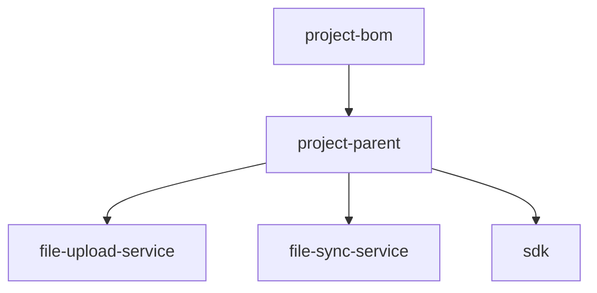

## 一、设计目标与原则

在企业级项目中，通常会采用 **三层 Maven 结构**：

| 层级                  | 作用                             | 是否可发布到私服 |
|---------------------|--------------------------------|----------|
| **BOM 层**           | 管理全局依赖版本（dependencyManagement） | ✅        |
| **Parent 层**        | 定义统一的构建规则、插件、编码规范              | ✅        |
| **Business 层（子模块）** | 各个业务模块、服务、SDK、组件等              | ✅        |

三者关系如下：

```
bom → parent → modules
```

* **BOM**：统一版本，不直接打包业务代码；
* **Parent**：继承 BOM，定义公共插件、统一打包配置；
* **Modules**：继承 Parent，专注业务逻辑开发。

---

## 二、推荐目录结构

```bash
project-root/
│
├── project-bom/               # 🔹 依赖版本管理（Dependency BOM）
│   └── pom.xml
│
├── project-parent/            # 🔹 父 POM（统一构建配置）
│   └── pom.xml
│
├── modules/                   # 🔹 业务模块（继承 parent）
│   ├── file-upload-service/
│   │   └── pom.xml
│   ├── file-sync-service/
│   │   └── pom.xml
│   ├── sdk/
│   │   └── pom.xml
│   └── ...
│
└── pom.xml                    # 🔹 顶层聚合（可选）
```

---

## 三、各层 pom.xml 示例

### 1. BOM 层（`project-bom/pom.xml`）

> 用于集中定义依赖版本，统一管理依赖冲突。

```xml

<project>
	<modelVersion>4.0.0</modelVersion>
	<groupId>com.xxx</groupId>
	<artifactId>project-bom</artifactId>
	<version>1.0.0</version>
	<packaging>pom</packaging>

	<dependencyManagement>
		<dependencies>
			<dependency>
				<groupId>org.springframework.boot</groupId>
				<artifactId>spring-boot-dependencies</artifactId>
				<version>3.3.2</version>
				<type>pom</type>
				<scope>import</scope>
			</dependency>

			<!-- 自定义依赖版本 -->
			<dependency>
				<groupId>com.squareup.okhttp3</groupId>
				<artifactId>okhttp</artifactId>
				<version>4.12.0</version>
			</dependency>
		</dependencies>
	</dependencyManagement>
</project>
```

---

### 2. Parent 层（`project-parent/pom.xml`）

> 继承 BOM，定义插件、编译参数、代码规范。

```xml

<project>
	<modelVersion>4.0.0</modelVersion>

	<parent>
		<groupId>com.xxx</groupId>
		<artifactId>project-bom</artifactId>
		<version>1.0.0</version>
		<relativePath>../project-bom/pom.xml</relativePath>
	</parent>

	<groupId>com.xxx</groupId>
	<artifactId>project-parent</artifactId>
	<version>1.0.0</version>
	<packaging>pom</packaging>

	<modules>
		<module>../modules/file-upload-service</module>
		<module>../modules/file-sync-service</module>
		<module>../modules/sdk</module>
	</modules>

	<properties>
		<java.version>17</java.version>
		<maven.compiler.source>${java.version}</maven.compiler.source>
		<maven.compiler.target>${java.version}</maven.compiler.target>
	</properties>

	<build>
		<pluginManagement>
			<plugins>
				<!-- 统一的构建插件、代码格式化、打包规则 -->
				<plugin>
					<groupId>org.apache.maven.plugins</groupId>
					<artifactId>maven-compiler-plugin</artifactId>
					<version>3.11.0</version>
				</plugin>
			</plugins>
		</pluginManagement>
	</build>
</project>
```

---

### 3. 子模块层（如 `modules/file-upload-service/pom.xml`）

> 继承 parent，编写实际业务逻辑。

```xml

<project>
	<modelVersion>4.0.0</modelVersion>

	<parent>
		<groupId>com.xxx</groupId>
		<artifactId>project-parent</artifactId>
		<version>1.0.0</version>
		<relativePath>../../project-parent/pom.xml</relativePath>
	</parent>

	<artifactId>file-upload-service</artifactId>
	<packaging>jar</packaging>

	<dependencies>
		<dependency>
			<groupId>org.springframework.boot</groupId>
			<artifactId>spring-boot-starter-web</artifactId>
		</dependency>
		<dependency>
			<groupId>com.squareup.okhttp3</groupId>
			<artifactId>okhttp</artifactId>
		</dependency>
	</dependencies>
</project>
```

---

## 四、结构关系图（Mermaid）



---

## 五、总结推荐

| 项目类型         | 建议结构                                | 备注             |
|--------------|-------------------------------------|----------------|
| 单体项目         | 只需 Parent                           | BOM 可合入 Parent |
| 中型项目（2~5 模块） | BOM + Parent + Modules              | 推荐结构           |
| 微服务/平台级项目    | BOM 独立发布，Parent 用于统一插件，Modules 聚合服务 | 最佳实践           |

---

非常好，这一步是把理论落地为“可复制的标准项目模板”。
我会给出：

1️⃣ 目录层级结构（包含 bom、parent、modules、archetype）
2️⃣ 各个模块说明
3️⃣ archetype 生成后的项目骨架（用于新项目初始化）
4️⃣ 补充 archetype 元数据（`archetype-metadata.xml`）
5️⃣ 构建与发布命令示例

---

## 一、整体目录结构

推荐在企业内部私服（如 Nexus）维护一个统一的 Maven 脚手架模板项目：

```bash
cloud-platform-archetype/
│
├── archetype-metadata.xml        # archetype 描述文件
├── pom.xml                       # archetype 构建文件
│
├── src/main/resources/archetype-resources/
│   ├── pom.xml                   # 顶层聚合 POM
│   │
│   ├── ${rootArtifactId}-bom/    # BOM 模块
│   │   └── pom.xml
│   │
│   ├── ${rootArtifactId}-parent/ # 父模块
│   │   └── pom.xml
│   │
│   ├── ${rootArtifactId}-modules/
│   │   ├── ${rootArtifactId}-common/    # 公共模块
│   │   │   ├── pom.xml
│   │   │   └── src/main/java/...        # 公共工具类
│   │   │
│   │   ├── ${rootArtifactId}-service/   # 核心业务模块
│   │   │   ├── pom.xml
│   │   │   └── src/main/java/...        # 示例代码
│   │   │
│   │   ├── ${rootArtifactId}-sdk/       # 客户端 SDK
│   │   │   ├── pom.xml
│   │   │   └── src/main/java/...        
│   │   │
│   │   └── pom.xml                      # modules 聚合 POM
│   │
│   └── README.md
│
└── src/test/resources/projects/basic/   # archetype 测试样例
```

---

## 二、各层模块职责

| 模块                            | 说明                             |
|-------------------------------|--------------------------------|
| **${rootArtifactId}-bom**     | 统一依赖版本管理（dependencyManagement） |
| **${rootArtifactId}-parent**  | 定义构建规范、插件、统一依赖导入（继承 BOM）       |
| **${rootArtifactId}-common**  | 公共工具类、异常封装、通用配置                |
| **${rootArtifactId}-service** | 核心业务逻辑模块（可为 Spring Boot 应用）    |
| **${rootArtifactId}-sdk**     | 对外 SDK 模块（封装调用、统一接口）           |
| **modules/pom.xml**           | 统一聚合所有业务模块                     |
| **顶层 pom.xml**                | 聚合所有子模块并提供统一 entrypoint        |

---

## 三、示例结构（archetype 生成后）

假设执行：

```bash
mvn archetype:generate \
    -DarchetypeGroupId=com.xxx \
    -DarchetypeArtifactId=cloud-platform-archetype \
    -DarchetypeVersion=1.0.0 \
    -DgroupId=com.acme.cloud \
    -DartifactId=cloud-platform \
    -Dversion=1.0.0-SNAPSHOT
```

生成的新项目结构如下：

```bash
cloud-platform/
│
├── cloud-platform-bom/
│   └── pom.xml
│
├── cloud-platform-parent/
│   └── pom.xml
│
├── cloud-platform-modules/
│   ├── cloud-platform-common/
│   ├── cloud-platform-service/
│   ├── cloud-platform-sdk/
│   └── pom.xml
│
└── pom.xml
```

---

## 四、关键文件示例

### 1️⃣ archetype-metadata.xml

此文件定义 archetype 中哪些文件将被复制，哪些变量可替换：

```xml

<archetype-descriptor
		name="cloud-platform-archetype"
		xmlns="http://maven.apache.org/plugins/maven-archetype-plugin/archetype-descriptor/1.1.0">
	<fileSets>
		<fileSet>
			<directory>src/main/resources/archetype-resources</directory>
			<includes>
				<include>**/*</include>
			</includes>
		</fileSet>
	</fileSets>
</archetype-descriptor>
```

---

### 2️⃣ archetype 自身 pom.xml

```xml

<project>
	<modelVersion>4.0.0</modelVersion>
	<groupId>com.xxx</groupId>
	<artifactId>cloud-platform-archetype</artifactId>
	<version>1.0.0</version>
	<packaging>maven-archetype</packaging>

	<name>Cloud Platform Maven Archetype</name>
	<description>DDD + BOM + Parent + Modules structure template</description>

	<build>
		<extensions>
			<extension>
				<groupId>org.apache.maven.archetype</groupId>
				<artifactId>archetype-packaging</artifactId>
				<version>3.3.0</version>
			</extension>
		</extensions>
	</build>
</project>
```

---

## 五、构建与发布命令

### 1️⃣ 构建 archetype 包

```bash
mvn clean install
```

### 2️⃣ 发布到私服（Nexus）

```bash
mvn deploy -DskipTests
```

### 3️⃣ 新项目生成

```bash
mvn archetype:generate \
  -DarchetypeGroupId=com.xxx \
  -DarchetypeArtifactId=cloud-platform-archetype \
  -DarchetypeVersion=1.0.0 \
  -DgroupId=com.acme.cloud \
  -DartifactId=acme-cloud-platform \
  -Dversion=1.0.0-SNAPSHOT
```

---

## 六、拓展建议

| 场景       | 建议                                                      |
|----------|---------------------------------------------------------|
| DDD 结构项目 | 增加 domain / application / infrastructure 层模板            |
| 微服务项目    | 可生成多个 service 模块模板（service-template、gateway-template 等） |
| SDK 平台   | 增加 testclient / examples 目录                             |
| 自动化初始化   | 可结合脚本实现 `init.sh` 一键生成并替换变量                             |


