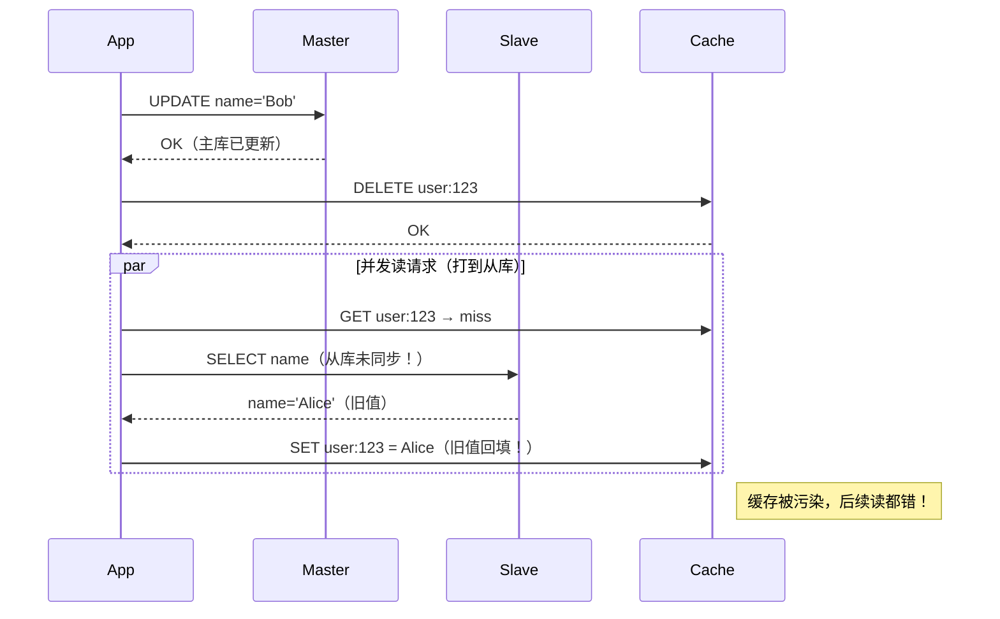

# 延迟双删

**“延迟双删”（Double Delete with Delay）** 虽然名字简单，但它在工程实践中并非万能，也并非为所有缓存一致性问题而生。要准确理解它
**到底解决什么、不解决什么**，必须结合系统架构、数据流向和并发模型来分析。

---

## ✅ 一、延迟双删的核心目标（它**真正解决的问题**）

> **防止在存在「主从复制延迟」或「读写分离」的系统中，因并发读请求从「未同步的从库」加载旧数据并回填缓存，导致缓存与主库长时间不一致。
**

### 🎯 关键前提条件（必须同时满足）：

1. **使用 Cache Aside 策略**（先更新 DB，再删缓存）
2. **数据库存在主从架构（Master-Slave）**
3. **读请求可能路由到从库（Slave）**
4. **主从同步存在延迟（通常 10ms ~ 1s+）**

---

## 📋 二、延迟双删解决的具体问题场景（真实案例）

### 场景：用户更新昵称后，页面仍显示旧昵称（持续数秒~数分钟）

#### 问题复现流程：



✅ **延迟双删的作用**：  
在第一次删除后，**等待足够时间（> 主从延迟）**，再删一次，清除可能被回填的旧数据。

---

## ❌ 三、延迟双删**不能解决**的问题（常见误区）

| 问题类型                     | 是否能解决 | 说明                           |
|--------------------------|-------|------------------------------|
| **1. 单机数据库并发读写不一致**      | ❌ 不能  | 单 DB 下 Cache Aside 本身足够，无需双删 |
| **2. 缓存穿透（查不存在的 key）**   | ❌ 不能  | 需用布隆过滤器或空值缓存                 |
| **3. 缓存雪崩（大量 key 同时过期）** | ❌ 不能  | 需加随机 TTL 或多级缓存               |
| **4. 数据库写失败但缓存已删**       | ❌ 不能  | 需事务回滚缓存操作（极难）                |
| **5. 强一致性要求（如金融转账）**     | ❌ 不能  | 需用分布式锁或直接不走缓存                |
| **6. 网络分区导致 DB 不可用**     | ❌ 不能  | 属于可用性问题，非一致性范畴               |

> 📌 **关键认知**：延迟双删是**最终一致性优化手段**，不是强一致性方案。

---

## 🧩 四、延迟双删的工作机制（为什么有效）

### 核心思想：**用时间换一致性**

通过引入一个“观察窗口”，确保：
> **所有可能因主从延迟而读到旧数据的请求，都已经执行完毕并回填了缓存，然后再清理一次**

### 操作步骤：

```python
def update_user(user_id, new_name):
    # Step 1: 更新主库
    db_master.update(user_id, new_name)
    
    # Step 2: 立即删除缓存（防止后续读命中旧缓存）
    cache.delete(f"user:{user_id}")
    
    # Step 3: 延迟（> 主从最大延迟，如 200ms）
    time.sleep(0.2)
    
    # Step 4: 再次删除缓存（清除可能被从库旧数据回填的值）
    cache.delete(f"user:{user_id}")
```

### 效果：

- 不一致窗口从 **缓存 TTL（如 30min）** 缩短到 **sleep 时间（如 200ms）**
- 业务感知：用户最多“闪现”一下旧数据，很快自动修复

---

## ⚠️ 五、使用延迟双删的**前提与代价**

### ✅ 适用条件：

- 系统采用 **主从读写分离**
- 接受 **最终一致性**（非强一致）
- 主从延迟 **可预测且稳定**（如 < 100ms）

### ❌ 代价与风险：

| 问题             | 说明                        |
|----------------|---------------------------|
| **写延迟增加**      | 每次写操作阻塞 `sleep` 时间        |
| **不能 100% 保证** | 若第二次删后又有旧读回填，仍可能污染（但概率极低） |
| **参数难调优**      | `sleep` 时间太短无效，太长影响性能     |
| **掩盖架构问题**     | 本质是“打补丁”，未解决读写分离的根本矛盾     |

---

## 🛠 六、更优的替代方案（推荐）

| 方案                  | 原理                               | 优势            |
|---------------------|----------------------------------|---------------|
| **1. 写后强制读主库**      | 写操作后，对相关 key 设置“读主标记”（TTL=1s）    | 无 sleep，一致性更强 |
| **2. Binlog 监听删缓存** | 通过 Canal/Debezium 监听 DB 变更，异步删缓存 | 解耦、可靠、无应用侵入   |
| **3. 消息队列延迟删除**     | 写 DB 后发 MQ 消息，消费者延迟删缓存           | 不阻塞主线程，支持重试   |
| **4. 关闭从库读（关键数据）**  | 对一致性敏感的数据，始终读主库                  | 最简单可靠，牺牲读扩展性  |

> 💡 **最佳实践**：
> - 普通业务：**延迟双删 + 监控主从延迟**
> - 核心业务：**写后读主 or Binlog 方案**

---

## ✅ 七、总结：延迟双删解决的问题清单

| ✅ 它解决的问题         | ❌ 它不解决的问题     |
|------------------|---------------|
| 主从延迟导致旧数据回填缓存    | 单机 DB 并发一致性问题 |
| 缓存与主库长时间不一致（分钟级） | 缓存穿透/雪崩       |
| 读写分离架构下的最终一致性优化  | 强一致性需求        |
| 应用层无法控制读从库的场景    | 数据库写失败回滚      |
| 简单、低成本的一致性提升手段   | 网络分区或高可用问题    |

---

## 📌 最终结论

> **延迟双删不是为“应用并发”而生，而是为“数据库主从延迟”而存在。**  
> 它是在 **Cache Aside + 读写分离** 架构下，**以可控写延迟为代价，换取缓存不一致时间大幅缩短** 的实用工程技巧。

如果你的系统：

- **没有主从** → **不需要延迟双删**
- **有主从但读写不分离**（所有读也走主库）→ **不需要**
- **有主从且读写分离** → **强烈建议评估是否需要**

希望这次的综合梳理能帮你彻底厘清这个经典缓存问题！