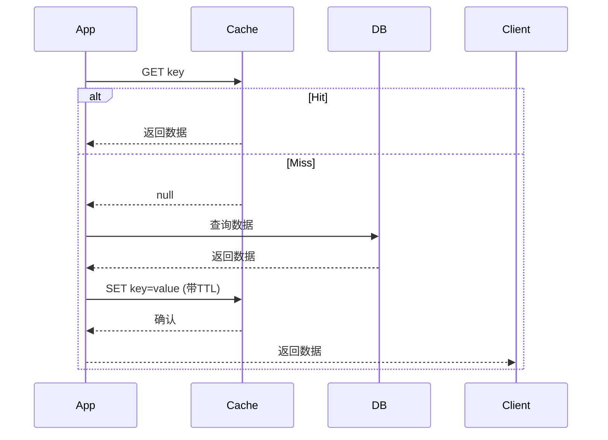
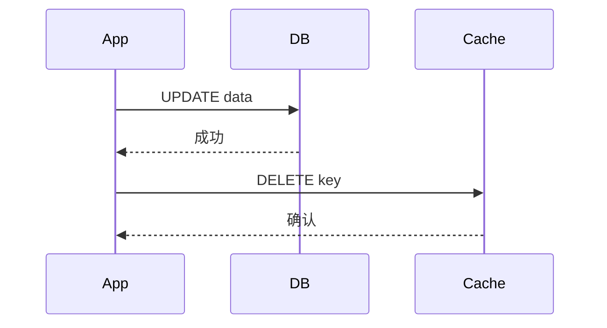
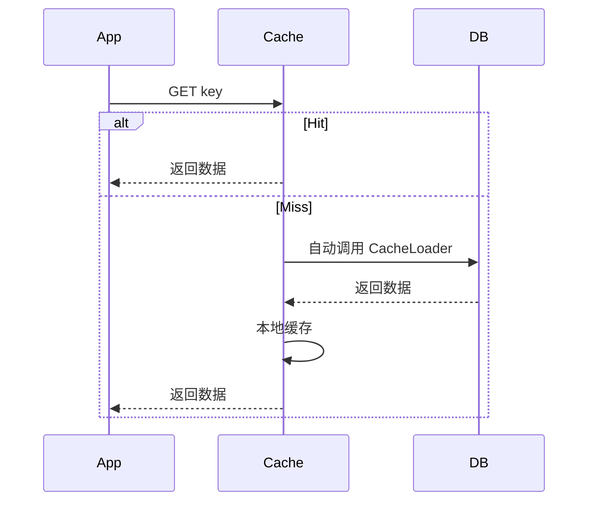
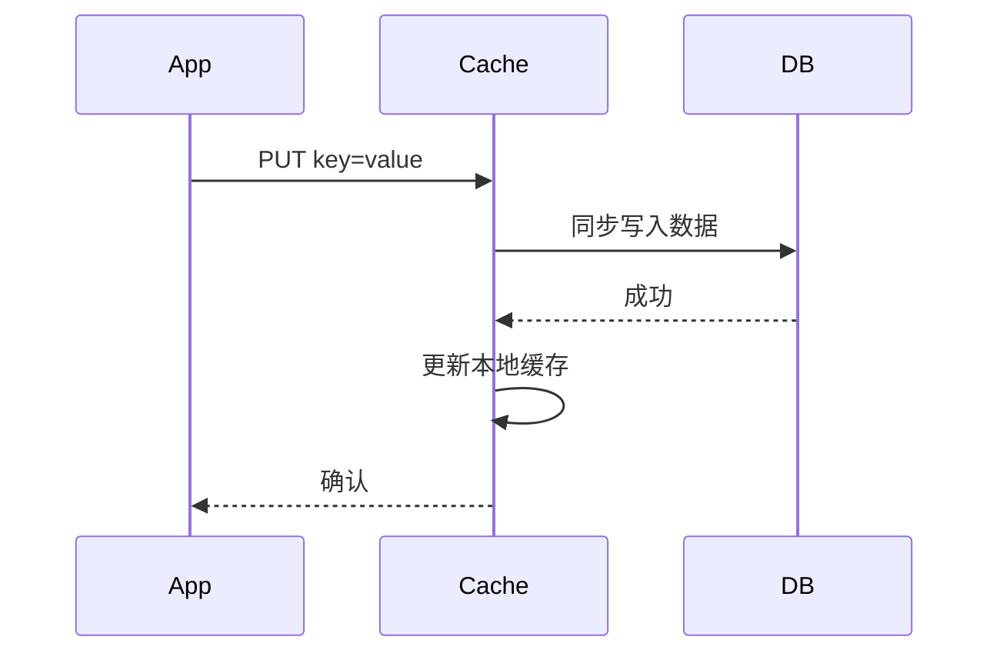
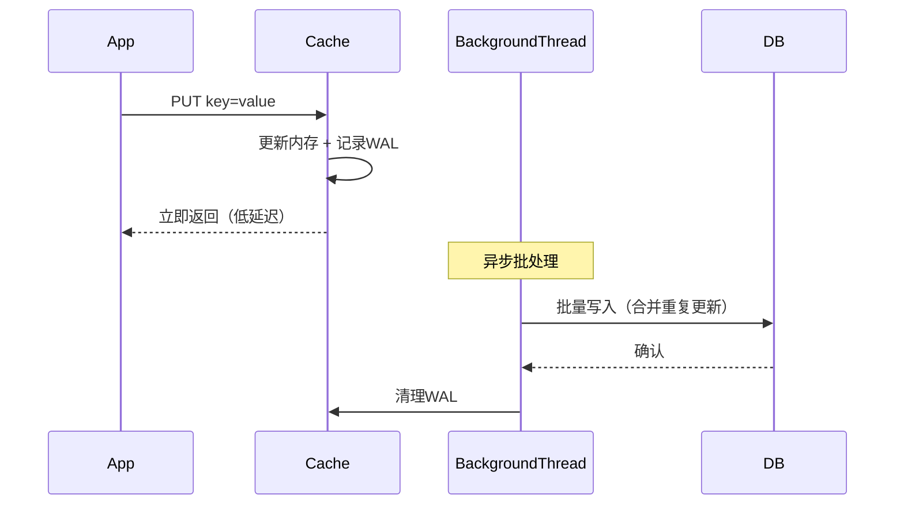
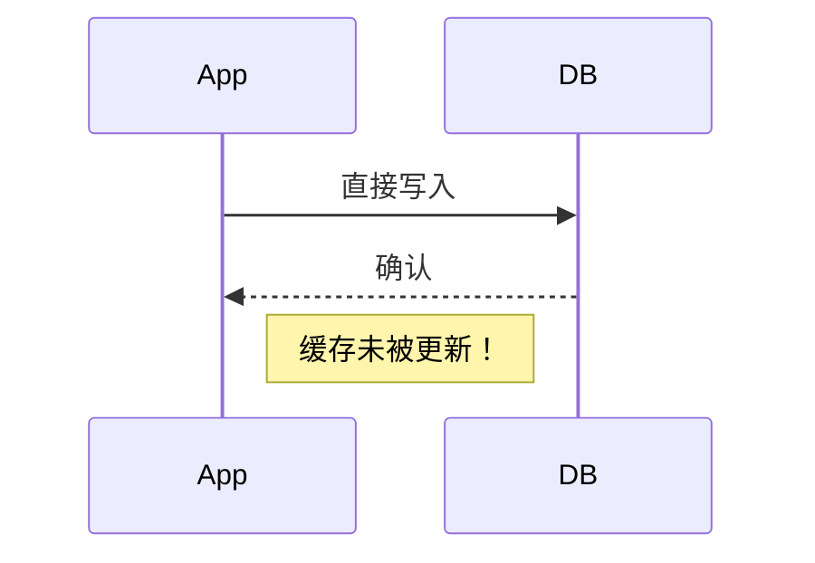

# 缓存读写策略

下面是对五种核心缓存读写策略（**Cache Aside**、**Read Through**、**Write Through**、**Write Behind**、**Write Around
**）的**超详细解析**，包括：

- **核心原理**
- **完整操作流程（含伪代码和时序说明）**
- **每一步的逻辑解释**
- **流程图（使用 Mermaid 语法，可直接在支持 Mermaid 的编辑器/文档中渲染）**
- **优缺点深度分析**
- **典型应用场景与避坑指南**

---

## 🧠 前置概念说明

在缓存系统中，我们通常有：

- **Application（App）**：业务应用
- **Cache**：缓存层（如 Redis、Memcached）
- **Database（DB）**：持久化存储（如 MySQL）

缓存策略的核心目标是在 **性能（低延迟）**、**一致性（正确性）** 和 **可靠性（容错）** 之间取得平衡。

---

## 1. Cache Aside（旁路缓存 / Lazy Loading）

### ✅ 核心思想

- 应用直接操作 **Cache + DB**
- **读**：先查缓存，未命中再查 DB 并回填缓存
- **写**：先更新 DB，**再删除缓存**（不是更新！）

> ⚠️ 为什么写时**删除**缓存而不是**更新**？
> - 避免写入无用数据（该数据可能永远不会被读）
> - 避免并发下“先更新缓存但 DB 更新失败”导致脏数据
> - 删除是幂等操作，更安全

---

### 📜 读操作流程（伪代码）

```python
def get_user(user_id):
    user = cache.get(f"user:{user_id}")
    if user is None:
        user = db.query("SELECT * FROM users WHERE id = ?", user_id)
        if user:
            cache.set(f"user:{user_id}", user, ttl=3600)
    return user
```

### ✍️ 写操作流程（伪码）

```python
def update_user(user_id, name):
    # 1. 先更新数据库
    db.execute("UPDATE users SET name = ? WHERE id = ?", name, user_id)
    # 2. 删除缓存（不是 set！）
    cache.delete(f"user:{user_id}")
```

---

### 🔄 时序图（Mermaid）





---

### ✅ 优点

- 实现简单，逻辑清晰
- 缓存只存热点数据，内存效率高
- 应用完全掌控缓存行为

### ❌ 缺点

- **存在短暂不一致窗口**：DB更新后、缓存删除前，若有并发读，可能读到旧缓存
- **缓存穿透风险**：恶意请求不存在的 key 会打穿 DB
- **首次读必穿透 DB**

### 🛠 并发问题解决方案

1. **延迟双删（Double Delete）**：
   ```python
   update_user():
       db.update()
       cache.delete(key)
       sleep(100ms)  # 等待可能的并发读完成
       cache.delete(key)  # 二次清理
   ```
2. **消息队列重试**：删除失败时发消息异步重试
3. **分布式锁（慎用）**：对 key 加锁，但影响性能

### 🎯 适用场景

- 读多写少（如商品详情、用户信息）
- 可接受最终一致性（如电商、社交）
- 需要灵活控制缓存策略（如自定义 TTL）

---

## 2. Read Through（读穿透）

### ✅ 核心思想

- **缓存层封装 DB 读逻辑**
- App 只与 Cache 交互，Cache 未命中时**自动从 DB 加载**

> 🔧 实现前提：缓存系统需支持 **CacheLoader**（如 Guava Cache、Caffeine）

---

### 📜 伪代码（以 Caffeine 为例）

```java
LoadingCache<String, User> cache = Caffeine.newBuilder()
        .build(key -> {
            // 自动从 DB 加载
            return db.getUserById(key);
        });

User user = cache.get("user:123"); // 未命中时自动调用 loader
```

---

### 🔄 时序图



> ✍️ 写操作仍需 App 直接操作 DB（或配合 Write Through）

---

### ✅ 优点

- App 无需处理缓存未命中逻辑
- 自动加载，代码简洁
- 本地缓存高效（如 Caffeine）

### ❌ 缺点

- **仅适用于本地缓存**（Redis 等远程缓存无法直接实现）
- 无法灵活控制加载逻辑（如多表 JOIN）
- 冷启动时大量请求可能压垮 DB（需配合 Refresh-Ahead）

### 🎯 适用场景

- 本地缓存（如 JVM 内缓存）
- 数据结构简单、加载逻辑固定的场景

---

## 3. Write Through（写穿透）

### ✅ 核心思想

- **写操作同步穿透到 DB**
- App 写 Cache → Cache **同步写 DB** → 更新自身

> 🔧 需缓存系统支持 **WriteThroughCache** 接口

---

### 📜 伪代码

```java
Cache<String, User> cache = Caffeine.newBuilder()
        .writer(new CacheWriter<String, User>() {
            @Override
            public void write(String key, User user) {
                db.updateUser(user); // 同步写 DB
            }

            @Override
            public void delete(String key, User user, RemovalCause cause) {
                db.deleteUser(key);
            }
        })
        .build();
```

---

### 🔄 时序图



---

### ✅ 优点

- 数据强一致性（写操作原子性）
- App 无需关心 DB 写入
- 缓存与 DB 始终同步

### ❌ 缺点

- **写性能受 DB 拖累**（同步阻塞）
- 实现复杂（需缓存层支持写透）
- 不适用于高写入吞吐场景

### 🎯 适用场景

- 金融交易、订单状态等强一致性场景
- 本地缓存 + 同步存储（如嵌入式数据库）

---

## 4. Write Behind（Write Back，写回）

### ✅ 核心思想

- **写操作只更新缓存，异步批量刷入 DB**
- 缓存作为**唯一写入点**

---

### 📜 工作流程

1. App 写入缓存
2. 缓存记录变更日志（WAL）
3. 后台线程按策略（时间/数量）批量写入 DB

> 🔧 需缓存系统支持持久化日志（如 Redis AOF + 自定义刷盘）

---

### 🔄 时序图



---

### ✅ 优点

- **写性能极高**（无 DB 同步等待）
- 减少 DB 压力（合并多次更新）
- 适合高吞吐写入

### ❌ 缺点

- **数据丢失风险**：缓存宕机 → WAL 丢失 → 数据丢失
- 一致性最弱（DB 滞后）
- 实现复杂（需 WAL、批处理、失败重试）

### 🎯 适用场景

- 日志收集、监控指标、点击流
- 可容忍数据丢失的场景（如“点赞数”）
- 写密集型系统（如 IoT 数据上报）

> 🔥 注意：**Redis 默认不是 Write Behind**！需自行实现异步刷盘逻辑。

---

## 5. Write Around（绕过缓存写入）

### ✅ 核心思想

- **写操作直接绕过缓存，只写 DB**
- 缓存仅通过**读操作**或**过期**更新

---

### 📜 伪代码

```python
def update_user(user_id, name):
    # 直接写 DB，不碰缓存
    db.execute("UPDATE users SET name = ? WHERE id = ?", name, user_id)

def get_user(user_id):
    user = cache.get(f"user:{user_id}")
    if not user:
        user = db.query("SELECT * FROM users WHERE id = ?", user_id)
        cache.set(f"user:{user_id}", user, ttl=3600)
    return user
```

---

### 🔄 时序图（写）



---

### ✅ 优点

- 避免缓存被**低频访问数据**污染
- 节省缓存写入开销（无 SET/DELETE 操作）

### ❌ 缺点

- **写后立即读 = 缓存未命中** → 必然穿透 DB
- 热点数据写入后首次读延迟高

### 🎯 适用场景

- 写入后**长时间不读**的数据（如审计日志、备份记录）
- 批量导入数据（避免缓存爆炸）
- 写操作远多于读（如传感器数据写入）

---

## 📊 策略对比总表

| 策略                | 一致性  | 读性能   | 写性能   | 实现复杂度 | 数据可靠性 | 典型场景           |
|-------------------|------|-------|-------|-------|-------|----------------|
| **Cache Aside**   | 最终一致 | ⭐⭐⭐⭐  | ⭐⭐    | ⭐     | ⭐⭐⭐⭐  | 通用（电商、社交）      |
| **Read Through**  | 强一致  | ⭐⭐⭐⭐  | -     | ⭐⭐    | ⭐⭐⭐⭐  | 本地缓存（Caffeine） |
| **Write Through** | 强一致  | -     | ⭐     | ⭐⭐⭐   | ⭐⭐⭐⭐  | 金融、订单          |
| **Write Behind**  | 弱一致  | -     | ⭐⭐⭐⭐⭐ | ⭐⭐⭐⭐  | ⭐     | 日志、监控、IoT      |
| **Write Around**  | 最终一致 | ⭐（写后） | ⭐⭐⭐⭐  | ⭐     | ⭐⭐⭐⭐  | 审计日志、批量导入      |

> 注：⭐越多表示性能/可靠性越高

---

## 🛠 实际工程建议

1. **默认用 Cache Aside**：90% 场景适用
2. **防缓存雪崩**：TTL 加随机抖动（如 `3600 ± 300s`）
3. **防缓存穿透**：对空结果也缓存（`NULL` + 短 TTL）
4. **高并发写**：考虑 **先删缓存 + 消息队列延迟双删**
5. **多级缓存**：本地缓存（Caffeine） + 远程缓存（Redis）
