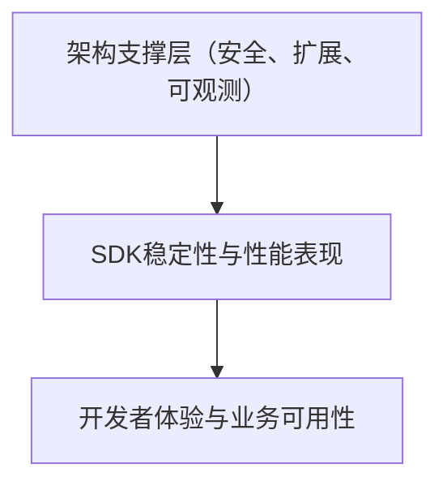

# SDK 非功能性设计（概述）

## 一、非功能性设计的核心目标

> 功能性设计解决“SDK能做什么”；
> 非功能性设计解决“SDK做得好不好”。

SDK 的非功能性设计主要关注**客户端开发者的体验质量**与**系统集成时的运行表现**，核心目标包括：

* **稳定可靠**：在异常或高并发场景下保证上传、下载等操作正确、可恢复。
* **高性能**：高效利用网络与线程资源，减少延迟，提升吞吐。
* **安全可控**：保证传输安全、鉴权正确、数据不泄露。
* **可观测可诊断**：问题可复现、可追踪、可快速定位。
* **可扩展可维护**：支持插件化扩展、低耦合演进。
* **可测试可验证**：支持单测、Mock、回归验证。

---

## 二、非功能性设计的主要维度

| 维度                                        | 设计目标                      | 典型设计点                                               |
|-------------------------------------------|---------------------------|-----------------------------------------------------|
| **稳定性与可靠性（Reliability & Resilience）**     | 确保 SDK 在网络异常、服务端波动下仍能稳定运行 | 幂等重试机制、熔断降级、限流、连接池复用、异常分级与错误码体系                     |
| **性能（Performance）**                       | 保证调用延迟与数据吞吐性能             | 异步I/O（CompletableFuture）、流式上传、断点续传、并行分块、P99延迟监控     |
| **安全性（Security）**                         | 确保数据与访问安全                 | 签名算法（HMAC/SHA256）、临时密钥、HTTPS 强制、敏感日志脱敏、参数校验         |
| **可观测性（Observability）**                   | 快速诊断与问题定位                 | 日志体系（支持SLF4J/Log4j）、TraceId链路追踪、进度回调、指标暴露接口         |
| **可扩展性（Extensibility）**                   | 支持多云、多存储、多算法扩展            | SPI 机制、自定义策略、可插拔签名器/进度监听器、模块化依赖隔离                   |
| **可维护性（Maintainability）**                 | 降低修改成本与维护风险               | 清晰模块划分（core/client/transport）、异常分层、代码规范、统一配置体系      |
| **可测试性（Testability）**                     | 易于验证功能与回归                 | Mock Server、HTTP Stub、JUnit + WireMock 测试、CI 集成测试脚本 |
| **可移植性与兼容性（Portability & Compatibility）** | 支持多平台与多版本 Java 环境         | 仅依赖轻量库（OkHttp、Jackson）、兼容 JDK8+、多云适配（COS/OBS/OSS）   |
| **合规性（Compliance）**                       | 满足安全与审计要求                 | 数据脱敏、操作日志、接口审计、隐私字段保护（不记录明文Key）                     |

---

## 三、非功能性设计的落地方法

### 1. **稳定性与可靠性设计**

* **重试策略**：

    * 对网络异常与 5xx 错误自动重试。
    * 支持指数退避算法，最大重试次数可配置。
    * 保证分块上传的幂等性。
* **熔断与限流**：

    * 引入轻量级熔断器（如 Resilience4j）封装。
    * 对客户端请求数、带宽进行限流。
* **连接池与线程模型**：

    * 基于 OkHttp 的连接池与异步调度线程复用。
    * 保证 `CloudFileClient` 可在多线程环境中安全共享。

---

### 2. **性能设计**

* **异步与并行优化**：

    * 使用 `CompletableFuture` 实现异步上传。
    * 分块上传时多线程并发处理。
* **流式传输**：

    * 避免一次性加载大文件至内存，采用流式读取。
* **性能基准与指标**：

    * 小文件（<5MB）：平均延迟 < 200ms，P99 < 1s。
    * 大文件：持续稳定吞吐，CPU 占用不超过 50%。

---

### 3. **安全设计**

* **认证与授权**：

    * 支持多种签名算法（HMAC、SHA256），通过 SPI 可扩展。
    * 敏感信息仅在内存中短期存在。
* **传输与存储安全**：

    * 全量 HTTPS 通信；
    * 禁止将签名Key写入日志或缓存。
* **输入验证与防护**：

    * 严格校验参数合法性与文件大小。
    * 防止请求走私与参数注入。

---

### 4. **可观测性设计**

* **日志体系**：

    * 基于 SLF4J 适配多日志框架（Logback、Log4j2）。
    * 支持配置日志级别与输出格式（JSON/Text）。
* **回调与指标**：

    * 上传/下载进度监听器（ProgressListener）。
    * 指标接口：成功率、平均延迟、重试次数。
* **Trace 与链路追踪**：

    * 统一生成 TraceId；可与服务端 Trace 链路关联。

---

### 5. **可扩展性设计**

* **SPI 插件机制**：

    * 提供 `SignatureProvider`、`ProgressListener`、`RetryPolicy` 等扩展点。
* **模块化设计**：

    * `core`（核心逻辑）、`client`（封装入口）、`transport`（传输层）。
    * 通过接口隔离实现可替换的 HTTP 客户端。

---

### 6. **可维护性设计**

* **代码规范**：

    * 严格遵循阿里 Java 开发手册。
    * 类职责单一，方法长度控制在 50 行内。
* **异常体系**：

    * SDKException → NetworkException / AuthException / ServerException / ClientException。
* **配置与注入**：

    * 支持 Spring Boot `@ConfigurationProperties` 注入。

---

### 7. **可测试性设计**

* **单元测试**：

    * 使用 JUnit5 + Mockito + WireMock。
* **集成测试**：

    * 通过 Mock Server 验证上传流程。
* **CI/CD 集成**：

    * 通过 GitLab CI 自动执行测试与覆盖率检查。

---

### 8. **可移植性与兼容性设计**

* **语言与版本兼容**：

    * 支持 JDK 8~21；
    * 无 Spring、Feign 等重型依赖。
* **多云兼容性**：

    * 适配 COS、OBS、OSS，统一抽象接口 `StorageProvider`。

---

### 9. **合规性设计**

* **隐私与数据保护**：

    * 禁止日志中出现 AccessKey、Token 明文。
    * 重要配置项支持脱敏与加密加载。
* **审计与安全扫描**：

    * 支持 SDK 操作日志审计输出；
    * 引入 OWASP 依赖安全扫描工具。

---

## 四、非功能性设计的度量指标

| 维度   | 指标         | 目标值     |
|------|------------|---------|
| 稳定性  | 成功率        | ≥ 99.9% |
| 性能   | 小文件 P99 延迟 | < 1s    |
| 安全性  | 漏洞数        | 0       |
| 可观测性 | Trace 丢失率  | < 1%    |
| 可扩展性 | SPI 插件可替换率 | ≥ 95%   |
| 可测试性 | 单测覆盖率      | ≥ 85%   |

---

## 五、非功能性设计在 SDK 生命周期中的嵌入

| 阶段       | 非功能性设计活动             |
|----------|----------------------|
| **需求阶段** | 明确性能目标、重试策略、日志与安全要求  |
| **设计阶段** | 定义 SPI 扩展点、模块划分、异常体系 |
| **开发阶段** | 实现线程安全、限流与异步机制       |
| **测试阶段** | 压测、Mock 测试、安全扫描      |
| **发布阶段** | 提供指标接口与日志策略说明文档      |

---

## 六、总结：SDK 非功能性设计金字塔

* **底层：架构支撑层** — 安全、可扩展、可观测能力。
* **中层：稳定性与性能层** — 确保 SDK 在多环境下表现一致。
* **顶层：开发者体验层** — 提供简单、可靠、可预测的集成体验。

