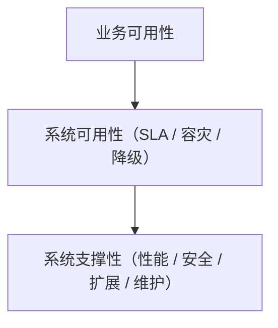

# 服务端非功能性设计（概述）

## 一、非功能性设计的核心目标

> 功能性设计解决“系统能做什么”；
> 非功能性设计解决“系统做得好不好”。

非功能性设计主要关注系统在不同场景下的**表现与体验质量**，目标包括：

* **稳定运行**（高可用、高可靠）
* **响应迅速**（高性能、低延迟）
* **易于扩展**（水平扩展、模块解耦）
* **安全可控**（访问控制、数据保护）
* **易于运维**（监控、告警、自动化部署）
* **易于维护**（低耦合、高内聚、可测试）

---

## 二、非功能性设计的主要维度

| 维度                        | 设计目标          | 典型设计点                             |
|---------------------------|---------------|-----------------------------------|
| **性能（Performance）**       | 保证系统响应速度和吞吐能力 | 缓存策略、连接池、异步处理、限流、压测、性能指标（P95/P99） |
| **可用性（Availability）**     | 系统持续提供服务的能力   | 主备切换、自动故障转移、熔断降级、心跳检测             |
| **可靠性与稳定性（Reliability）**  | 数据与行为的正确性与一致性 | 分布式事务、幂等设计、数据校验、重试与补偿             |
| **可扩展性（Scalability）**     | 支持业务规模增长      | 微服务拆分、无状态设计、负载均衡、水平扩展             |
| **可维护性（Maintainability）** | 降低维护成本        | 模块化架构、代码规范、自动化测试、CI/CD            |
| **可观测性（Observability）**   | 快速定位问题        | 日志埋点、指标监控、分布式追踪、链路分析              |
| **可移植性（Portability）**     | 迁移与部署灵活       | 容器化、配置中心、环境抽象                     |
| **可测试性（Testability）**     | 系统易于验证与回归     | Mock设计、集成测试、自动化测试框架               |
| **安全性（Security）**         | 防止未授权访问与攻击    | 鉴权鉴权、SQL注入防护、加密传输、数据脱敏、审计日志       |
| **兼容性（Compatibility）**    | 支持多平台与多版本     | 向后兼容API、跨云适配、版本管理                 |
| **合规性（Compliance）**       | 满足法规与公司标准     | 数据合规（GDPR、网络安全法）、隐私保护             |

---

## 三、非功能性设计的落地方法

### 1. **性能设计**

* **缓存层设计**：本地缓存（Caffeine）、分布式缓存（Redis）。
* **异步与并发优化**：线程池、CompletableFuture、消息队列削峰填谷。
* **数据库优化**：索引、读写分离、SQL优化、连接池（HikariCP）。
* **压测基准**：明确 QPS、TPS、响应时间指标。

### 2. **高可用设计**

* **服务层**：负载均衡（Nginx、Gateway）、自动重试、熔断降级（Resilience4j）。
* **数据层**：主从复制、异地多活、备份与恢复机制。
* **任务层**：幂等、任务补偿机制（如基于状态机的任务恢复）。

### 3. **安全设计**

* **身份认证**：OAuth2、JWT、SSO。
* **访问控制**：RBAC/ABAC 模型、多租户隔离。
* **数据保护**：加密（AES/RSA）、传输安全（HTTPS）、脱敏。
* **安全扫描**：代码漏洞扫描、依赖库安全扫描。

### 4. **可观测性设计**

* **日志**：结构化日志（JSON格式）、统一TraceId。
* **指标**：Prometheus + Grafana。
* **链路追踪**：SkyWalking / OpenTelemetry。
* **告警**：规则化告警与分级策略。

### 5. **可维护与可运维设计**

* **DevOps**：CI/CD流水线（Jenkins/GitLab CI）。
* **自动化部署**：Kubernetes、Helm。
* **配置管理**：Nacos / Spring Cloud Config。
* **灰度发布**：金丝雀部署、流量分级。

### 6. **扩展性与可移植性设计**

* 模块解耦：DDD + 接口隔离。
* 插件式架构：SPI/策略模式/责任链。
* 环境抽象：配置化部署（YAML + 环境变量）。
* 容器化与镜像构建：Docker + K8s。

---

## 四、非功能性设计的度量指标

| 维度   | 指标            | 示例            |
|------|---------------|---------------|
| 性能   | RT、QPS、TPS    | P99 < 200ms   |
| 可用性  | SLA、MTBF、MTTR | 可用性 ≥ 99.9%   |
| 可靠性  | 数据一致性率        | 异常重试成功率 > 99% |
| 可维护性 | 平均修复时间        | 平均恢复时间 < 30分钟 |
| 安全性  | 安全事件数         | 漏洞数为 0        |
| 可观测性 | 告警响应时间        | ≤ 5分钟         |

---

## 五、在架构设计阶段的嵌入方式

| 阶段         | 非功能性设计活动                                        |
|------------|-------------------------------------------------|
| **需求分析阶段** | 定义NFR（Non-functional Requirements）指标，如SLA、QPS目标 |
| **架构设计阶段** | 设计非功能性方案（缓存、限流、容灾、安全策略等）                        |
| **开发阶段**   | 编码规范、日志埋点、监控埋点、幂等设计                             |
| **测试阶段**   | 压测、安全扫描、容灾演练                                    |
| **运维阶段**   | 监控、告警、灰度发布、容量评估                                 |

---

## 六、总结：非功能性设计的“三层金字塔”

* **底层：系统支撑性** — 决定架构稳固性。
* **中层：系统可用性** — 决定系统是否可持续提供服务。
* **顶层：业务可用性** — 决定用户体验与业务连续性。

