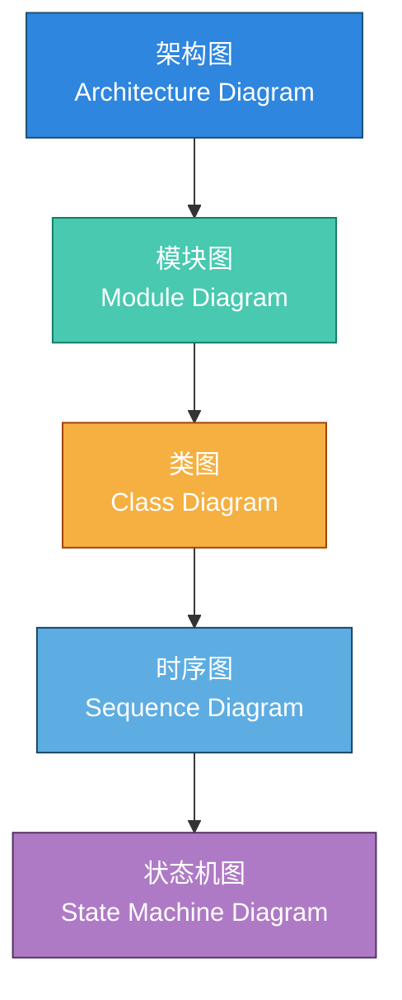

非常好 ✅，以下是为你整合的正式文档：
**《系统代码梳理与设计图谱规范文档》**
——基于你前面提到的“架构图、模块图、类图、时序图、状态机图”等核心图形标准，并结合代码分析视角，完整呈现从系统到业务的结构化分析方法。

---

# 🧭 系统代码梳理与设计图谱规范文档

## 一、目的

本文档旨在规范系统在**架构设计、代码梳理、业务分析**过程中的图谱体系，
明确各类图的用途、层级关系及梳理重点，
以提升系统可理解性、可维护性与可演进性。

适用于以下场景：

* 新系统架构设计；
* 现有系统代码结构梳理；
* 模块职责划分与重构；
* 业务流程分析与优化。

---

## 二、总体图谱结构

从宏观到微观，系统结构可分为五个层次：

```
架构图 → 模块图 → 类图 → 时序图 → 状态机图
```

它们依次回答五个核心问题：

| 层级  | 代表图  | 核心问题       |
| --- | ---- | ---------- |
| 系统层 | 架构图  | 系统由哪些部分组成？ |
| 模块层 | 模块图  | 每个模块负责什么？  |
| 代码层 | 类图   | 模块内部怎么实现？  |
| 业务层 | 时序图  | 流程是怎么走的？   |
| 状态层 | 状态机图 | 对象状态怎么变化？  |

---

## 三、各类图说明

### 1️⃣ 架构图（Architecture Diagram）

#### 🎯 目的

展示系统整体结构与技术选型，明确服务边界与交互关系。

#### 🔍 关注点

* 系统分层结构（如 DDD：接口层 / 应用层 / 领域层 / 基础设施层）；
* 服务或模块划分；
* 外部依赖（数据库、缓存、消息队列、第三方 API）；
* 通信方式（HTTP、RPC、MQ）；
* 部署单元与容灾架构（如主云/备云）。

#### 📘 输出内容

* 系统分层关系图；
* 各服务职责说明；
* 外部系统交互概览。

---

### 2️⃣ 模块图（Module Diagram）

#### 🎯 目的

说明系统内各功能模块的职责与依赖，建立“模块边界感”。

#### 🔍 关注点

* 模块（或包）的功能职责；
* 模块间依赖方向；
* 模块对外暴露的接口（Controller、Service、Facade）；
* 内部组件依赖（Repository、Client、Adapter）；
* 与代码包结构映射关系。

#### 📘 输出内容

* 模块职责说明；
* 模块依赖图；
* 接口定义与调用关系。

---

### 3️⃣ 类图（Class Diagram）

#### 🎯 目的

展示模块内部类与对象的关系结构，是模块图的细化。

#### 🔍 关注点

* 领域模型结构（聚合根、实体、值对象）；
* 类之间的继承、实现、组合、依赖；
* 设计模式体现（策略、工厂、模板、责任链等）；
* 关键数据流（DTO、Entity、VO 的转换路径）；
* 数据持久化对象与接口实现映射。

#### 📘 输出内容

* 关键类及关系说明；
* 模块内部对象协作图；
* 领域模型设计图。

#### ⚙️ 附属位置

* 模块图的下级（展示内部结构）；
* 或嵌入时序图（展示参与对象）。

---

### 4️⃣ 时序图（Sequence Diagram）

#### 🎯 目的

展示接口调用链与业务执行流程，是理解业务逻辑的核心。

#### 🔍 关注点

* 接口调用顺序（Controller → Service → Manager → Repository → Adapter）；
* 异步任务、消息、回调的触发逻辑；
* 事务边界与状态变更点；
* 跨模块或跨服务的调用链。

#### 📘 分类与适用场景

| 类型          | 起点   | 特点        | 适用场景      |
| ----------- | ---- | --------- | --------- |
| **接口级时序图**  | 单接口  | 描述入口接口调用链 | 接口分析、调试   |
| **子流程时序图**  | 模块逻辑 | 聚焦单一子流程   | 异步回调、任务处理 |
| **聚合流程时序图** | 业务过程 | 跨接口/跨模块   | 全链路业务追踪   |

#### 📘 输出内容

* 主流程调用链图；
* 子流程或异步逻辑图；
* 外部系统交互序列。

---

### 5️⃣ 状态机图（State Machine Diagram）

#### 🎯 目的

描述核心对象或任务在生命周期中的状态变化与事件驱动逻辑。

#### 🔍 关注点

* 状态枚举定义；
* 状态流转条件（触发事件、回调、任务、异常）；
* 失败与终止状态；
* 状态可逆性与补偿机制。

#### 📘 输出内容

* 对象生命周期图；
* 状态流转表；
* 异常与回退机制描述。

---

## 四、图之间的层级组织关系（结构示意）

```text
┌───────────────────────────────────────────────┐
│               系统级视图（System Level）       │
│                                               │
│  ┌─────────────────────────────────────────┐  │
│  │  架构图（Architecture Diagram）          │  │
│  └─────────────────────────────────────────┘  │
│                    │                          │
│                    ▼                          │
│             ┌──────────────────────┐          │
│             │ 模块图（Module Diagram）│        │
│             └──────────────────────┘          │
│                    │                          │
│                    ▼                          │
│         ┌────────────────────────────┐        │
│         │ 类图（Class Diagram）       │        │
│         └────────────────────────────┘        │
│                    │                          │
│                    ▼                          │
│       ┌────────────────────────────────┐      │
│       │ 时序图（Sequence Diagram）      │      │
│       └────────────────────────────────┘      │
│                    │                          │
│                    ▼                          │
│        ┌───────────────────────────────┐      │
│        │ 状态机图（State Machine Diagram）│    │
│        └───────────────────────────────┘      │
└───────────────────────────────────────────────┘
```

---

## 五、代码梳理时的关注重点（检查清单）

| 图类型  | 在代码中关注的内容      | 核心输出   |
| ---- | -------------- | ------ |
| 架构图  | 包结构、服务划分、外部依赖  | 系统整体视图 |
| 模块图  | 模块职责、接口关系、依赖方向 | 模块边界定义 |
| 类图   | 类关系、继承结构、聚合关系  | 模块内部结构 |
| 时序图  | 调用链、异步流程、事务边界  | 业务执行流程 |
| 状态机图 | 状态枚举、事件触发、流转逻辑 | 对象生命周期 |

---

## 六、应用场景建议

| 目的      | 推荐图组合      | 输出形式   |
| ------- | ---------- | ------ |
| 系统架构说明  | 架构图 + 模块图  | 架构白皮书  |
| 模块设计文档  | 模块图 + 类图   | 模块设计说明 |
| 业务流程分析  | 时序图 + 状态机图 | 业务流程文档 |
| 故障分析与调试 | 时序图 + 状态机图 | 故障分析报告 |

---

## 七、扩展：Mermaid 版本（可嵌入 Markdown / Confluence）



---

## 八、结论

通过以上五类图的系统化梳理，可以实现：

* **架构可视化**：清晰展示系统层级结构与依赖；
* **模块边界清晰化**：明确职责与数据流；
* **业务流程透明化**：便于理解和优化；
* **状态逻辑标准化**：确保任务与对象生命周期有据可依；
* **协作标准化**：研发、测试、运维共享统一视图。

